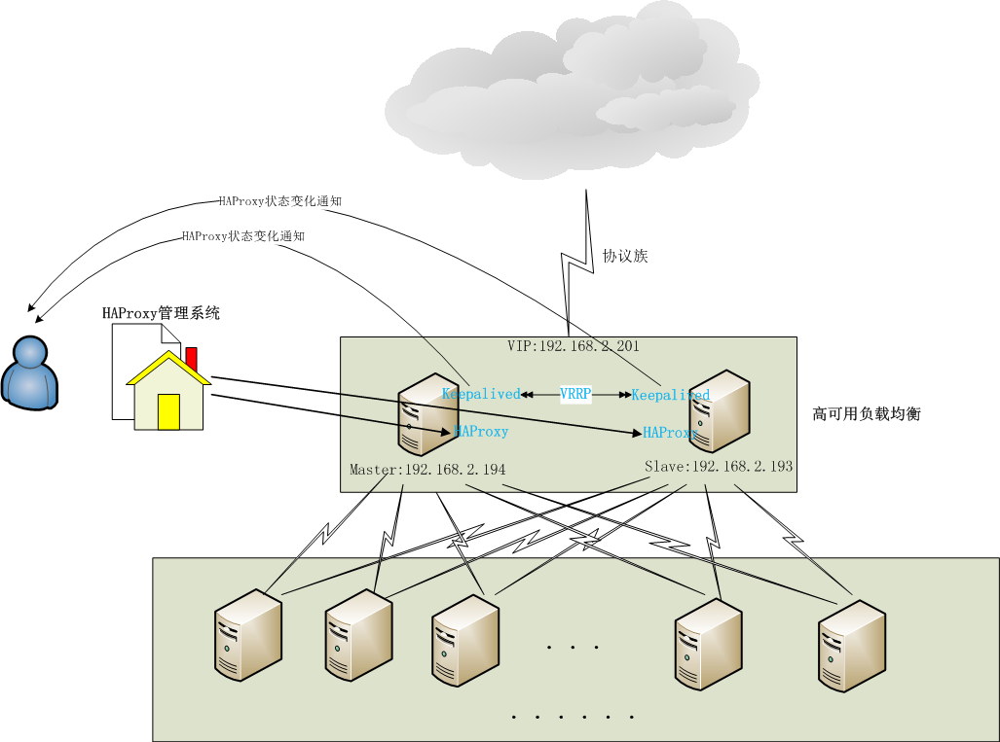
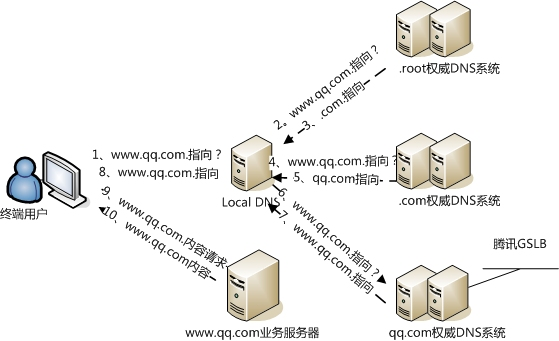

该项工作，如题所示，主要分为两部分：高可用负载均衡组件、缓存 DNS。

## 高可用负载均衡组件

需求：优化业务系统架构中某些关键环节，针对 TCP 层数据流量进行负载均衡，并保证服务的高可用。

技术选型：HAProxy + Keepalived，这对组合比较常见成熟。

另外，由于 HAProxy 的负载均衡任务可能比较多，靠人工修改配置来增删改任务不方便可靠，所以实现了一个简单的 HAProxy 管理系统，
以后经实际使用验证和完善会开放源码。

## 缓存 DNS

先以 www.qq.com 为例，解释一下域名解析过程：

1. 用户向 Local DNS 发起 `www.qq.com.` 查询请求；
2. Local DNS 向根服务器发起 `com.` 查询请求；
3. 根服务器向 Local DNS 返回 `com.` 解析记录；
4. Local DNS 向 `com.` 权威服务器发起 `qq.com.` 查询请求；
5. `com.` 权威服务器向 Local DNS 返回 `qq.com.` 解析记录；
6. Local DNS向 `qq.com.` 权威服务器发起 `www.qq.com.` 查询请求；
7. `qq.com.` 权威服务器向 Local DNS 返回 `www.qq.com.` 解析记录；
8. Local DNS 向用户返回 `www.qq.com` 解析记录。

Local DNS 一般由网络运营商（如电信、网通等）提供。

缓存 DNS 处于用户端（这是一个相对的概念）与 local DNS 之间，利用 DNS 服务器软件的缓存功能以及缓存 DNS 与用户端的近距离特点来加速域名解析。

也可以在缓存 DNS 上按需求进行域名劫持。运营商为了牟利，也会在 local DNS 上进行域名劫持，这对于各大互联网公司对外提供的服务来说是个很大的问题。

------

在完成该工作后，我编写了一份安装配置文档，方便其他同事参考。文档见： [HAProxy+HAProxyConsole+Keepalived+BIND安装配置文档.pdf](../assets/high-availability-load-balancer-and-dns.pdf)。