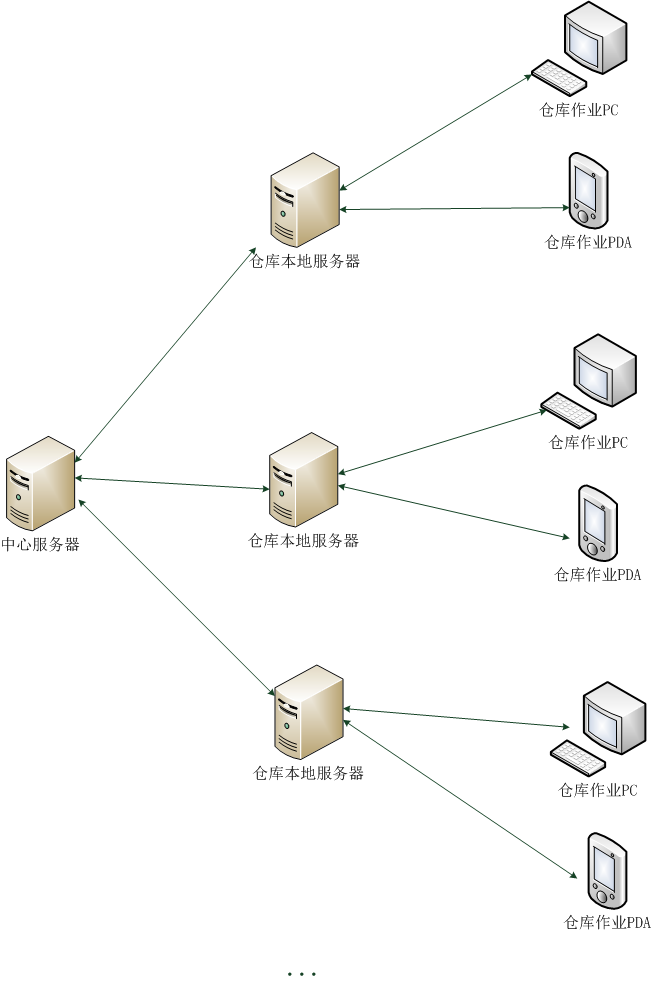
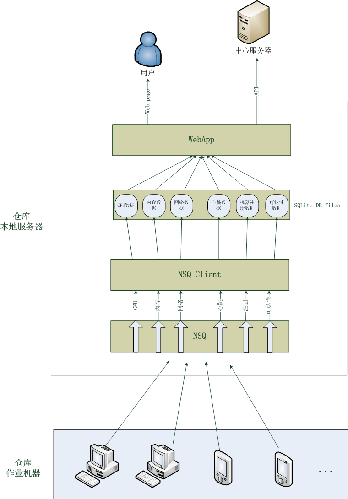

近期在参与一个仓库作业机器监控项目。该项目的需求背景是：公司的电商业务在全国各地有多处或大或小的仓库，仓库的作业人员（没有IT技术背景）经常反馈/投诉作业机器断网、断电、连不了服务等问题。实际情况经常与反馈的不一致，但运维侧并没有数据可以证明，所以才有了这个项目的需求。

该项目第一期的目标仅是*收集、展示作业机器某些监控指标数据，以便在快速定位解决问题，或至少有数据可查*。

为了避免大量监控数据上报影响到生产系统的网络服务，系统采用如下结构：

1. 实现一个 agent 用于在仓库作业 PC 或作业 PDA 上获取机器的监控数据；
2. 在仓库本地服务器上实现一个数据收集处理服务，提供 API 给 agent 上传监控数据；数据收集处理服务会将接收到的数据持久化到数据库，提供给仓库本地服务器上的 webApp 进行数据展示等；
3. 中心服务器可以调用各个仓库本地服务器上的 webApp 提供的数据查询接口（数据用于定位、发现问题）；定期按需对各个仓库本地服务器上的数据进行归档。

这样，主要的工作都集中在**作业机器上的 agent** 和**数据收集处理服务、webApp**。这其中最关键的又是**数据收集处理服务**。考虑到需要多地部署运维仓库本地服务器，而且某些大仓库作业机器的数目目前已多达800-1000，我们做了如下技术选型：

1. Golang 实现 agent、数据收集处理服务、webApp；
2. 以 SQLite 作为数据库来存储agent上报的所有数据；
3. 以 [NSQ](http://bitly.github.io/nsq/) 作为异步消息队列中间件；

选用 Golang 的理由是：可以静态编译，部署简单，只需将编译好的可执行二进制程序丢到服务器上跑起来就可以了。

选用 SQLite 的理由是：不必像 MySQL 那样安装 server 程序，无需额外部署维护。当然 SQLite 的文件锁会大大影响数据库读写性能，我们通过尽可能拆分数据库，将不同的指标数据存储在不同的 SQLite DB 文件中，甚至将每台作业机器每个指标的每天的数据分别存储在不同的 DB 文件中，来尽可能减小文件锁的性能影响，目前看来效果还不错。

选择 NSQ 的理由是：Golang 实现、分布式、伸缩性好、性能高、支持 HTTP/TCP 协议、自带web管理界面等。

详细的系统结构图如下所示：

NSQ 支持多 topic（不同 topic 的数据不同），topic 又可以有多个 channel（同一个 topic 的所有channel中的数据相同，以多播的方式实现，每个 channel 在 client 中有一个对应的处理流程来处理 channel 中的数据）。我们将作业机器不同的监控指标数据作为不同 topic 传入 NSQ，多数指标数据只需持久化到数据库以备后用，所以这些 topic 仅需一个 channel。

webApp 基于 Beego 框架实现，避免重复造轮子、工作量小。webApp中的数据展示采用 HighCharts、Raphael 实现，兼容性好。

对于机器指标数据，其实不应该使用关系型数据库来存储，因为这种数据的特点是：写入之后只读不改、时间序列的、几乎没有关系型的读取操作、连续批量数据读取，所以开源监控系统如 Cacti、Ganglia 等均使用 RRDtool 来读写指标数据。所以如上所述，我们将指标数据的存储尽可能地拆分成多个文件以提高读写性能而不会造成其他问题。

------

系统的工作流程如下所述：

1. 作业机器上的 agent 启动后会先向 NSQ 的 register topic 发送一个注册消息，NSQ Client 根据该注册消息在 register 数据表中将该作业机器的状态改为“正常运行中”；
2. 然后，agent 定期上报监控数据到 NSQ，NSQ Client 中各种数据的处理流程将数据持久化到 SQLite 数据库文件；
3. 用户访问/中心服务器调用API时，webApp 读取 SQLite 数据库；
4. 有一个 Goroutine 针对注册过的作业机器定期检测3分钟以内是否收到过其上报的心跳数据，若未收到，则将机器状态从“正常运行中”改成“运行异常”，若收到，则将“运行异常”改为“正常运行中”；
5. 作业机器在正常关机时会向 NSQ 的 register topic 发送一个正常关机的消息，Client 读取到该消息后，会将该机器在 register 数据表中的状态改为“已正常关机”。

目前，系统工作良好。之后会对系统做压测，如果出现瓶颈，估计可能还是数据存储，这样的话我们可能会尝试 RRDtool 或 [InfluxDB](http://influxdb.org/)。