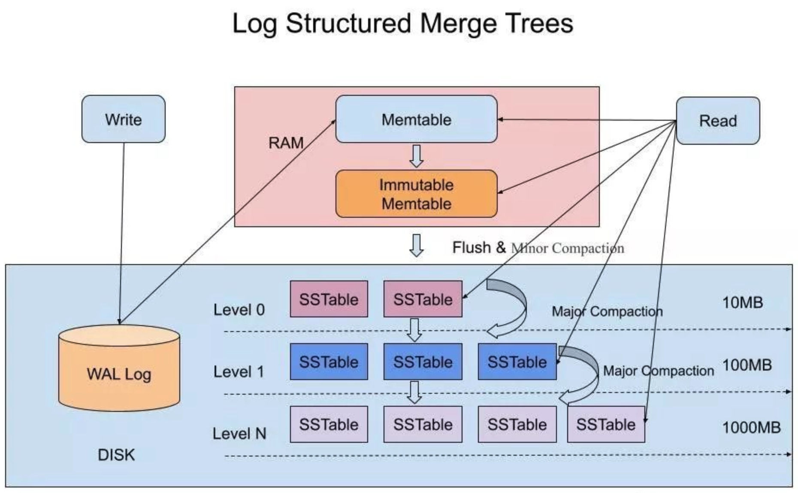
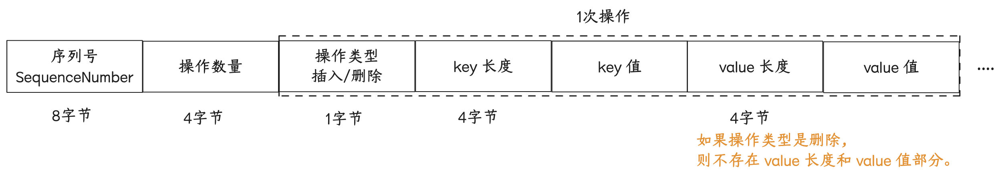
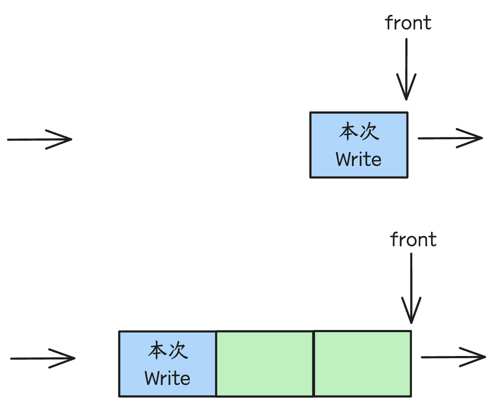
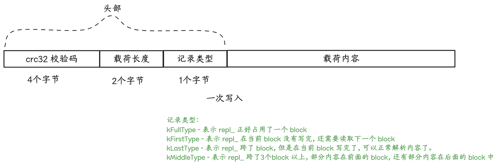
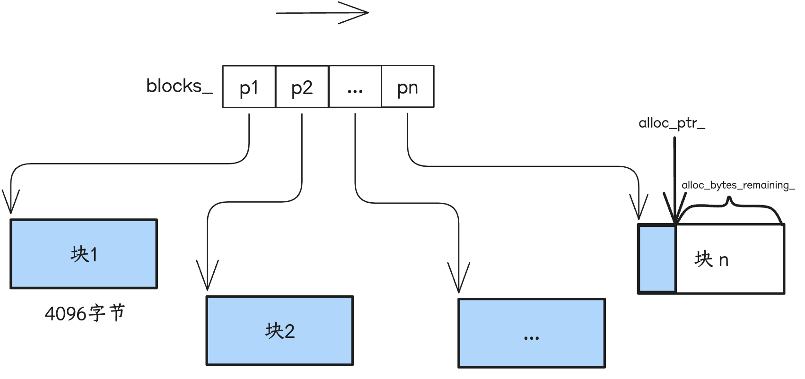
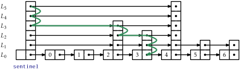
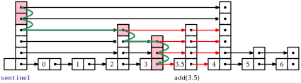
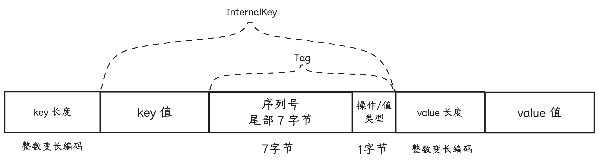

## 0、设计概要&接口定义



```plantuml-svg
interface DB {
+ {static} Status Open(const Options& options, const std::string& name, DB** dbptr)
+ virtual Status Put(const WriteOptions& options, const Slice& key, const Slice& value) = 0
+ virtual Status Delete(const WriteOptions& options, const Slice& key) = 0
+ virtual Status Write(const WriteOptions& options, WriteBatch* updates) = 0
+ virtual Status Get(const ReadOptions& options, const Slice& key, std::string* value) = 0
+ virtual Iterator* NewIterator(const ReadOptions& options) = 0
}

class DBImpl {
+ Status Put(const WriteOptions&, const Slice& key, const Slice& value) override
+ Status Delete(const WriteOptions&, const Slice& key) override;  
+ Status Write(const WriteOptions& options, WriteBatch* updates) override;  
+ Status Get(const ReadOptions& options, const Slice& key, std::string* value) override;  
+ Iterator* NewIterator(const ReadOptions&) override

- Status Recover(VersionEdit* edit, bool* save_manifest)

- Env* const env_
- const InternalKeyComparator internal_comparator_ 
- const InternalFilterPolicy internal_filter_policy_
- const Options options_
- const std::string dbname_

- TableCache* const table_cache_

- FileLock* db_lock_

- port::Mutex mutex_
- MemTable* mem_
- MemTable* imm_
- WritableFile* logfile_
- log::Writer* log_

- std::deque<Writer*> writers_
- WriteBatch* tmp_batch_

- SnapshotList snapshots_

- VersionSet* const versions_
}

DB <|-- DBImpl
```

基于 DB 类的静态方法 Open 来打开/初始化一个数据库，Open 会实例化一个 DBImpl 对象，调用其私有方法 Recover 来恢复/初始化状态，并将 DBImpl 对象指针赋值给 dbptr 返回给调用方，调用方通过 dbptr 调用 Put/Write/Delete/Get/NewIterator 进行读写操作。

## 1、WriteBatch

Put 和 Delete 是针对单个 key 进行操作，在底层会将键值操作包装成 WriteBatch 对象，然后调用 Write 接口执行实际的操作流程。

也可以在调用侧实例化 WriteBatch 对象，将一批增删操作都先填充到 WriteBatch 对象，然后直接调用 Write 接口执行一批操作，这样写吞吐应该会更高一点。这批操作是<u>原子的</u>（一起写成功或者失败）。

```plantuml-svg
class WriteBatch {
+ void Put(const Slice& key, const Slice& value)
+ void Delete(const Slice& key)
+ Status Iterate(Handler* handler) const
- std::string rep_
}

class Slice {
+ Slice(const char* d, size_t n)
+ Slice(const std::string& s)
+ Slice(const char* s)

+ const char* data() const
+ size_t size() const
+ const char* begin() const
+ const char* end() const

- const char* data_;  
- size_t size_;
}

class WriteBatch::Handler {
+ virtual void Put(const Slice& key, const Slice& value) = 0
+ virtual void Delete(const Slice& key) = 0
}

class MemTableInserter {
+ void Put(const Slice& key, const Slice& value)
+ void Delete(const Slice& key)
+ SequenceNumber sequence_
+ MemTable* mem_
}

class MemTable {
+ void Ref()
+ void Unref()
+ Iterator* NewIterator()
+ void Add(SequenceNumber seq, ValueType type, const Slice& key, const Slice& value)
+ bool Get(const LookupKey& key, std::string* value, Status* s)

- KeyComparator comparator_;  
- int refs_;  
- Arena arena_;  
- Table table_;
}

WriteBatch .. WriteBatch::Handler: 关联
WriteBatch .. Slice: 关联
WriteBatch::Handler <|-- MemTableInserter: 继承/实现
MemTableInserter *-- MemTable: 组合
```

```cpp
//
typedef uint64_t SequenceNumber; // 虽然序列号使用了的 uint64_t 类型，但是实际只会使用 56 比特，即最大值为 ((0x1ull << 56) - 1)
// We leave eight bits empty at the bottom so a type and sequence#  
// can be packed together into 64-bits.  
static const SequenceNumber kMaxSequenceNumber = ((0x1ull << 56) - 1);
//
typedef SkipList<const char*, KeyComparator> Table;
```

**rep_ 存储结构**

```text
// WriteBatch::rep_ :=  
//    sequence: fixed64  
//    count: fixed32  
//    data: record[count]  
// record :=  
//    kTypeValue varstring varstring         |  
//    kTypeDeletion varstring  
// varstring :=  
//    len: varint32  
//    data: uint8[len]
```



$SequenceNum$ 是当前 WriteBatch 所有操作的基准序列号，即 WriteBatch 中第一个操作的序列号为 $SequenceNum + 0$ ，第二个操作的序列号为 $SequenceNum + 1$，依次类推。为每次操作分配一个唯一的序列号，是为了方便实现快照能力。后面再解释。

## 2、写入缓冲与攒批

```plantuml-svg
class DBImpl::Writer {
+ WriteBatch* batch
+ bool sync
+ bool done
+ port::CondVar cv
}

class WriteBatch {}
class port::CondVar {
+ void Wait()
+ void Signal()
+ void SignalAll()

- std::condition_variable cv_
- Mutex* const mu_
}
DBImpl::Writer .. WriteBatch: 关联
DBImpl::Writer .. port::CondVar: 关联
```

leveldb 的 write 写入过程基于 Writer （双端）队列实现缓冲和可能的攒批（合并多个 WriteBatch），提升写入的吞吐性能。攒批的性能空间来自 - 如果写入时发现 level0 文件过多（compaction 未完成，影响读/检索性能），则认为需要对写入进行限速，将写入先在 Write 队列中缓冲，攒 1ms 左右，合并成一个大的 WriteBatch 然后写入 memtable。



如果本次写入的 Writer 为队列头部，则说明当前写入压力应该不大，可以直接进行写入操作 -
- 1、先确认写入条件是否满足：
    - (1) level0 文件数是否超过阈值（8），如果超过，说明写入压力有点大（都来不及 minor compaction 啦），则释放互斥锁，当前线程休眠 1ms（攒批的性能空间在这！）
    - （2） 如果当前 memtable 空间已满（默认大小 4MB，可配置），并且前一个 memtable（当前已不可变）还没有被 compaction 落盘或者 level0 文件数操作更大的一个阈值（12），则等待后台 compaction 完成
    - （3） 如果当前 memtable 空间已满，但是前一个 memtable 已被 compaction 且 level0 文件数也不多，则将当前 memtable 切换为不可变 memtable，并申请一个新的 memtable，同时清理掉当前的 WAL log 文件，准备个新的 WAL log 文件。
- 2、遍历 Writer 队列，直到队尾或者遇到一个非异步写入操作或者达到攒批大小阈值，将遍历到的 Writer 中的 WriteBatch 合并成一个 WriteBatch
- 3、将合并后的 WriteBatch 的 `rep_` 先写入 WAL log 文件
- 4、然后将 WriteBatch 中的操作按序解析出来，写入 memtable (Put 或 Delete)。

如果本次写入的 Writer 非队列的头部，等待之前写入队列的线程攒批处理，以及最后被唤醒。

如果不考虑等待 compaction，整个写入过程最慢的步骤是写 WAL 日志，所以 WriteBatch 设计是为 WAL 日志写入优化的，对于 memtable 写入反而多了一点解析的性能开销。

## 3、WAL log 文件

```cpp
static const int kBlockSize = 32768;

// Header is checksum (4 bytes), length (2 bytes), type (1 byte).  
static const int kHeaderSize = 4 + 2 + 1;
```



leveldb 会将 WriteBatch 的 `rep_` 当作字节序列写入 log 文件中。不过 log 文件存储的单元结构为块（block），块大小为 32768 字节。一个 WriteBatch 的 `rep_` 的大小可能大于/等于/小于一个块大小，也就是写入一个 `rep_` 可能填不满一个块或者正好填满一个块或者跨多个块。
如果一次写入后，当前 block 剩余的空间不足以填充下一次写入的头部，则直接将剩余空间以 `\x00` 填满。

这样编码的好处？- 读取解析时，按块大小进行读取，速度更快，顺序解析也方便。

“WAL log” 的核心作用：写入 memtable 的键值对数据，并没有落盘到 ldb 数据库文件中，如果在 minor compaction 成 $level_0$ 文件之前，机器节点故障，导致 memtable 以及不可变 memtable 中的数据丢失，还可以通过“WAL log” 文件内容来恢复。
那也意味着，如果一旦不可变 memtable 数据 compaction 到 $level_0$ 文件后，这些数据状态对应的“WAL log” 内容就没没有实际用处了，可以及时清理掉。

leveldb 写入数据时，如果发现 memtable 占用内存已达到阈值，并且不可变 memtable 数据已被 minor compaction 成 $level_0$ 文件，则会将 memtable 切换成不可变 memtable，同时创建一个新的“WAL log”，并申请一个新的 memtable。不过此时新的不可变 memtable 还没被 minor compaction 成 $level_0$ 文件，所以前一个“WAL log”文件也还要保留，不能删除。

## 4、MemTable

```plantuml-svg
class MemTable {
+ void Ref()
+ void Unref()
+ Iterator* NewIterator()
+ void Add(SequenceNumber seq, ValueType type, const Slice& key, const Slice& value)
+ bool Get(const LookupKey& key, std::string* value, Status* s)

- KeyComparator comparator_;  
- int refs_;  
- Arena arena_;  
- Table table_;
}

class Arena {
+ char* Allocate(size_t bytes)
+ char* AllocateAligned(size_t bytes)

- char* AllocateFallback(size_t bytes)
- char* AllocateNewBlock(size_t block_bytes)
- char* alloc_ptr_
- size_t alloc_bytes_remaining_  
- std::vector<char*> blocks_
}

MemTable *-- Arena: 组合
```

```cpp
typedef SkipList<const char*, KeyComparator> Table;
```

MemTable 是对应一个“WAL log” 文件的内存存储结构。<u>单个 MemTable 内存占用阈值为 4MB(`write_buffer_size`)</u>，当可变 MemTable 的内存占用达到阈值时，就尝试切换成不可变 MemTable，并创建一个新的 WAL log 文件以及对应的可变 MemTable 来承接写入，而不可变 MemTable 的内容等待被 minor compaction 刷成一个 $level_0$ ldb 数据文件。

```cpp
// Amount of data to build up in memory (backed by an unsorted log  
// on disk) before converting to a sorted on-disk file.  
//  
// Larger values increase performance, especially during bulk loads.  
// Up to two write buffers may be held in memory at the same time,  
// so you may wish to adjust this parameter to control memory usage.  
// Also, a larger write buffer will result in a longer recovery time  
// the next time the database is opened.  
size_t write_buffer_size = 4 * 1024 * 1024;
```

### 4.1 Arena

Arena 的特点是整块内存申请，整块内存一次性释放，从而优化内存的申请释放开销。
leveldb 里 Arena 的生命周期与 MemTable 对象保持一致，MemTable 对象的所有 Add 操作涉及的内存分配都在同一 Arena 对象上进行， MemTable 对象切换成不可变状态并存储为 level0 ldb 文件后，Arena 对象的所有内存块随着 MemTable 对象析构而一次性释放。

```cpp
static const int kBlockSize = 4096;
```



从 Arena 申请内存空间时，如果最新一个可用块的剩余内存大小（`alloc_bytes_remaining_`）小于当前申请的内存大小 bytes，则先申请一个新的内存块，然后从新内存块上分配内存空间 - 如果当前申请的内存大小大于整块大小的 1/4，则单独占用一个内存块。
所以 Arena 内存块大小必须大于实际一次申请的最大内存，并且为减少内存碎片，应该要根据代码中实际的内存分配情况来确定 Arena 内存块大小。

MemTable 的 Arena 内存块大小只有一种。有些项目中内存分配情况比较复杂的话，其 Arena 设计通常会使用多种内存块大小 ，以此提高灵活性，减少内存碎片浪费。

### 4.2 Table - 跳表

跳表可以兼顾有序链表的快速查找、快速插入/删除、遍历，算法复杂度 $O(logN)$，实现简单。

> [Open Data Structures - Skiplists](https://opendatastructures.org/newhtml/ods/latex-saved-html/skiplists.html)

**查找过程示意图**



**插入过程示意图**



**跳表定义**

```cpp
template <typename Key, class Comparator>  
class SkipList {
public:
  explicit SkipList(Comparator cmp, Arena* arena);
  void Insert(const Key& key);
  bool Contains(const Key& key) const;
private:
  Comparator const compare_;  
  Arena* const arena_;  // Arena used for allocations of nodes  
  Node* const head_;
  // Modified only by Insert().  Read racily by readers, but stale  
  // values are ok.  
  std::atomic<int> max_height_;  // Height of the entire list  
  // Read/written only by Insert().  
  Random rnd_;
}
```

**跳表节点定义**

```cpp
template <typename Key, class Comparator>  
struct SkipList<Key, Comparator>::Node {
  explicit Node(const Key& k) : key(k) {}
  Key const key;

private:
  // Array of length equal to the node height.  next_[0] is lowest level link.
  std::atomic<Node*> next_[1];
}
```

- `key` 存储节点实际的值
- `next_` 数组中每个指针指向横向的邻居节点

memtable 对跳表模板实际使用的实际类型为：

```cpp
typedef SkipList<const char*, KeyComparator> Table;
```

对 Key - `char*` 的实际编码方式：

```cpp title:MemTableInserter
class MemTableInserter : public WriteBatch::Handler {  
 public:  
  SequenceNumber sequence_;  
  MemTable* mem_;  
  
  void Put(const Slice& key, const Slice& value) override {  
    mem_->Add(sequence_, kTypeValue, key, value);  // 插入
    sequence_++;  
  }  
  void Delete(const Slice& key) override {  
    mem_->Add(sequence_, kTypeDeletion, key, Slice());  // 删除
    sequence_++;  
  }  
};

void MemTable::Add(SequenceNumber s, ValueType type, const Slice& key,  
                   const Slice& value) {  
  // Format of an entry is concatenation of:  
  //  key_size     : varint32 of internal_key.size()
  //  key bytes    : char[internal_key.size()]
  //  tag          : uint64((sequence << 8) | type)
  //  value_size   : varint32 of value.size()
  //  value bytes  : char[value.size()]
  size_t key_size = key.size();  
  size_t val_size = value.size();  
  size_t internal_key_size = key_size + 8;  // 另外8字节存储 Tag
  const size_t encoded_len = VarintLength(internal_key_size) +  
                             internal_key_size + VarintLength(val_size) +  
                             val_size;  
  char* buf = arena_.Allocate(encoded_len);  
  char* p = EncodeVarint32(buf, internal_key_size);  
  std::memcpy(p, key.data(), key_size);  
  p += key_size;  
  EncodeFixed64(p, (s << 8) | type);  
  p += 8;  
  p = EncodeVarint32(p, val_size);  
  std::memcpy(p, value.data(), val_size);  
  assert(p + val_size == buf + encoded_len);  
  table_.Insert(buf);  
}
```



- 整数变长编码：“key 长度” 和 “value 长度”正常是32bit（4字节）整数，但 key 和 value 实际可能是比较短的字节序列（比如：长度小于128时，只要1个字节就能存储长度，而不是4字节）。
- 序列号仅使用尾部7个字节：序列号大小不会超过7个字节？确认一下哪里有约束
- 操作/值类型：
  - `kTypeValue = 0x1` 表示当前操作为 插入，有对应的值
  - `kTypeDeletion = 0x0` 表示当前操作为 删除，无对应的值（或者说值为空）。<u>正常来说，后面无需再编码“value 长度” 和 “value 值”，不过代码实现中似乎还是占用了1个字节来存储“value 长度” 0，可以优化？</u>。

`KeyComparator` 的定义：

```cpp title:KeyComparator
struct KeyComparator {  
  const InternalKeyComparator comparator;  
  explicit KeyComparator(const InternalKeyComparator& c) : comparator(c) {}  
  int operator()(const char* a, const char* b) const;  //
};

int MemTable::KeyComparator::operator()(const char* aptr,  
                                        const char* bptr) const {  
  // Internal keys are encoded as length-prefixed strings.  
  Slice a = GetLengthPrefixedSlice(aptr);  // 取出 internal key（包含 tag）
  Slice b = GetLengthPrefixedSlice(bptr);  
  return comparator.Compare(a, b);  
}

class InternalKeyComparator : public Comparator {  
 private:  
  const Comparator* user_comparator_; // 用户可配置自定义的 key 比较器，默认为 BytewiseComparator - 逐个字节比较
  
 public:  
  explicit InternalKeyComparator(const Comparator* c) : user_comparator_(c) {}  
  const char* Name() const override;  
  int Compare(const Slice& a, const Slice& b) const override;  
  void FindShortestSeparator(std::string* start,  
                             const Slice& limit) const override;  
  void FindShortSuccessor(std::string* key) const override;  
  
  const Comparator* user_comparator() const { return user_comparator_; }  
  
  int Compare(const InternalKey& a, const InternalKey& b) const;  
};

int InternalKeyComparator::Compare(const Slice& akey, const Slice& bkey) const {  
  // Order by:  
  //    increasing user key (according to user-supplied comparator)
  //    decreasing sequence number
  //    decreasing type (though sequence# should be enough to disambiguate)
  int r = user_comparator_->Compare(ExtractUserKey(akey), ExtractUserKey(bkey));  // ExtractUserKey 会忽略 Tag，比较原始 key
  if (r == 0) {  
    const uint64_t anum = DecodeFixed64(akey.data() + akey.size() - 8);  // 取出 Tag
    const uint64_t bnum = DecodeFixed64(bkey.data() + bkey.size() - 8);  // 取出 Tag
    if (anum > bnum) {  // 比较 Tag（序列号 + 操作类型）
      r = -1;  
    } else if (anum < bnum) {  
      r = +1;  
    }  
  }  
  return r;  
}
```

实际的比较逻辑为：
- 1、先比较原始的 key，小的排在前面
- 2、如果原始 key 相等，则比较序列号，<u>序列号大的排在前面（**有点奇怪？这个逻辑很关键！点查/有序遍历/compaction 同 key 记录去重等依赖这个逻辑**）</u>

### 4.3 引用计数

MemTable 使用的 引用计数 变量 `int refs_`，不是原子变量，所以计数增减都需要加互斥锁。并且因为计数减到小于等于0时， memtable 还需要析构自己，所以必须加锁。

```cpp
// Drop reference count.  Delete if no more references exist.  
void Unref() {  
  --refs_;  
  assert(refs_ >= 0);  
  if (refs_ <= 0) {  
    delete this;  
  }  
}
```