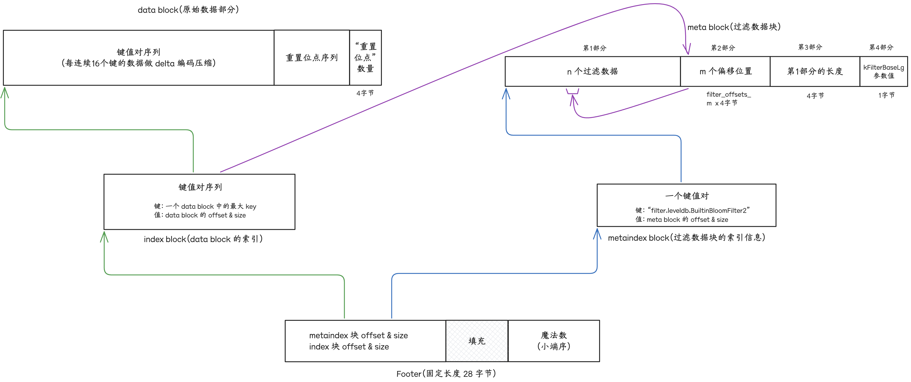
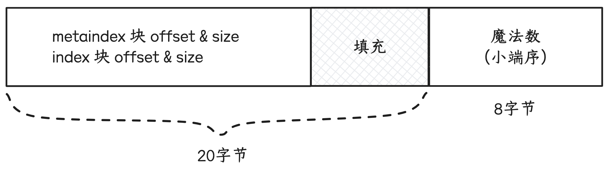
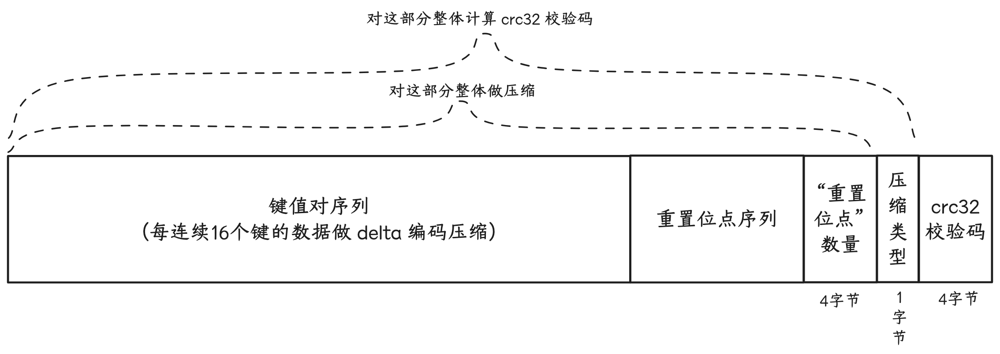
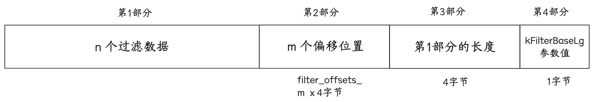

## 5、leveldb 数据文件格式 - ldb

```text
<beginning_of_file>
[data block 1]
[data block 2]
...
[data block N]
[meta block 1]
...
[meta block K]
[metaindex block]
[index block]
[Footer]        (fixed size; starts at file_size - sizeof(Footer))
<end_of_file>
```

leveldb 文件（文件后缀 `.ldb`）内容由 N 个 “data 块” 部分、 K 个 “meta 块” 部分、1个 “metaindex 块” 部分、1个 “index 块”部分、1个 “Footer” 部分依次构成。



ldb 数据文件的加载解析流程：
- 1、取文件末尾的 28 个字节，解析出(1) metaindex block 的 offset & size (2) index block 的 offset & size
- 2、根据 metaindex block 的 offset & size 解析出 “过滤策略名称” 和 meta block 的 offset & size
    - 根据“过滤策略名称” 实例化过滤策略
    - 对于 meta block 的解析，先解析出“第3部分” 和 “第4部分”的值，得到“第1部分”的长度，继而得到“第2️部分”的偏移位置和长度（也即 `filter_offsets_` 的内容）
- 3、根据 index block 的 offset & size 解析出所有 data block 的“key 区间”、offset 和 size

“点查”，对于 ldb 数据文件的检索流程为：
- 1、使用 key，从最新版本中从小到大逐个 level 匹配其文件元数据
- 2、对目标 ldb 文件，使用 key 从 index block 中通过二分查找匹配到目标 data block 的 offset & size
- 3、根据目标 data block 的 offset 对 meta block 的 `filter_offsets_` 计算而后取到目标过滤数据块，交给过滤策略实例进行初步的匹配筛选
- 4、如果 3 中没有匹配到，则根据目标 data block 的 offset 计算取到 data block 的“重置位点序列”，继而对 data block 的“键值对序列”进行解析遍历匹配

### 5.1 “Footer”部分

长度为固定值 `kEncodedLength`（$2 * BlockHandle::kMaxEncodedLength + 8 = 28$）
先后存入：
- 1、“metaindex 块”在文件中的偏移位置 offset 和 块大小 size。
- 2、“index” 块在文件中的偏移位置 offset 和 块大小 size。
- 3、将“Footer”长度填充 到 $2 * BlockHandle::kMaxEncodedLength = 20$ 长度。
- 4、以小端序写入一个64比特的魔法数。



### 5.2 “块”的格式

将键值写入块的内存缓冲区时，每连续 16 （默认值，可配置）个键会进行 delta 编码压缩：

- 1、先计算当前键与前一次写入键的共同前缀长度
- 2、依次写入“键共同前缀长度”、“当前键去掉共同前缀后的长度”、“值的长度”、“当前键去掉共同前缀后的内容”、“值内容”

如果连续“delta 编码压缩”的键数/写入次数达到阈值 16，则将当前内存缓冲区的大小记录到“重置位点列表”（`restarts_`）中。

将块的内存缓存区内容落到文件的流程：

- 1、把<u>“重置位点列表”中的元素</u>依次逐个添加到缓冲区尾部。
- 2、将<u>“重置位点”数量</u>以固定32比特长度添加到缓冲区尾部。
- 3、将缓冲区内容整体做一次通用压缩（可配置 不压缩、snappy 压缩、zstd 压缩）。
- 4、将压缩后的字节序列写入文件后，再将 压缩类型(CompressionType，1字节) 和 “压缩后的字节序列 与 压缩类型” 的 crc32 校验码（4字节）写到文件的尾部。

```cpp
enum CompressionType {  
  // NOTE: do not change the values of existing entries, as these are  
  // part of the persistent format on disk.
  kNoCompression = 0x0,  
  kSnappyCompression = 0x1,  
  kZstdCompression = 0x2,  
};
```



### 5.3 “data 块”

leveldb 文件中“data 块”数据是按照 key 有序存储的。同一个文件中，块与块之间有序，块之间 key 范围不会有重合，块内内容也是按 key 有序存储。

因为有序， 使用默认的 BytewiseComparator，delta 编码压缩效果通常会明显。

对于“data 块”，如果块的内存缓冲区内容大小（通用压缩前的原始内容大小+重置位点数组大小+重置位点数组长度）超过 4KB（可配置，配置项 `block_size`），就会将块的内存缓冲区作为一个“data 块”落到文件中。

```cpp
// Approximate size of user data packed per block.  Note that the  
// block size specified here corresponds to uncompressed data.  The  
// actual size of the unit read from disk may be smaller if  
// compression is enabled.  This parameter can be changed dynamically.  
size_t block_size = 4 * 1024;
```

### 5.4 “index 块”

“index 块” 存储 “data 块” 的索引信息。

当一个“data 块”从内存缓存区落到文件后，将该“data 块”最后/最大的 key（经存储优化处理后） 作为 键（<u>大致含义-当前块中所有 key 都小于该键，下一个块中所有 key 都大于等于该键</u>），该“data 块”在文件中的偏移位置 offset 和 块大小 size 打包后作为值，写入“index 块”内存缓冲区。
当 leveldb 文件的所有“data 块”都写入文件后，会将“index 块”内存缓冲区内容也按照“块”格式写入文件。

Get key 检索时，
- 1、先从 “Footer” 部分取出“index 块的” offer 和 size，
- 2、然后在“index 块”进行二分查找，找到目标“data 块”，
- 3、从目标“data 块”中解析出来重置位点数组，继续进行二分查找。

### 5.5 “meta 块” & “metaindex 块”

```cpp title:FilterBlockBuilder
// A FilterBlockBuilder is used to construct all of the filters for a  
// particular Table.  It generates a single string which is stored as  
// a special block in the Table.  
//  
// The sequence of calls to FilterBlockBuilder must match the regexp:  
//      (StartBlock AddKey*)* Finish  
class FilterBlockBuilder {  
 public:  
  explicit FilterBlockBuilder(const FilterPolicy*);  
  
  void StartBlock(uint64_t block_offset);  
  void AddKey(const Slice& key);  
  Slice Finish();  
  
 private:  
  void GenerateFilter();  
  
  const FilterPolicy* policy_;  

  std::string keys_;             // Flattened key contents  
  std::vector<size_t> start_;    // Starting index in keys_ of each key  

  std::string result_;           // Filter data computed so far  
  std::vector<Slice> tmp_keys_;  // policy_->CreateFilter() argument  
  std::vector<uint32_t> filter_offsets_;  
};

void FilterBlockBuilder::StartBlock(uint64_t block_offset) {  
  uint64_t filter_index = (block_offset / kFilterBase);  
  assert(filter_index >= filter_offsets_.size());  
  while (filter_index > filter_offsets_.size()) {  
    GenerateFilter();  
  }  
}

void FilterBlockBuilder::AddKey(const Slice& key) {  
  Slice k = key;  
  start_.push_back(keys_.size());  
  keys_.append(k.data(), k.size());  
}
```

目前的实现，如果 leveldb 文件中存在“meta 块”，应该也只会有一个，即**过滤数据块**。

如果 leveldb 数据库开启了检索时过滤策略（FilterPolicy），则对于写入“data 块”的每个 key，都会被记录到 filter 内存缓冲区（`FilterBlockBuilder`）中。
当一个“data 块”刷到文件后，就对 FilterBlockBuilder 中存入的 key 序列算一下“过滤数据”，拼接到 `result_` 后面，以及将最新计算的“过滤数据”在 `result_` 中的偏移位置存到 `filter_offets_` 向量中。

```text title:filter_offsets_生成逻辑
准备处理第一个“data 块”时，
- FilterBlockBuilder 的 filter_offsets_ 为空数组 []， result_ 为空字符串 ""
- 当第一个“data 块”刷到数据文件后，准备处理第二个“data 块”，因<u>逻辑上</u>约束每 2KB 数据算一次过滤数据
	- case-1：如果第一个“data 块”大小 < 4KB（大概率是这样），那么 filter_index = 1，对这个“data 块”的所有 key 算一次过滤数据，result_ 长度为 a， filter_offset_ 将变成 [0],
	- case-2：如果第一个“data 块”大小 >（=）4KB且< 8KB，那么 filter_index = 2，对这个“data 块”的所有 key 算一次过滤数据，result_ 长度为 a'，filter_offset_ 将变成 [0, a']
	- case-3：如果第一个“data 块”大小 >（=）8KB且< 16KB，那么 filter_index = 3，对这个“data 块”的所有 key 算一次过滤数据，result_ 长度为 a''，filter_offset_ 将变成 [0, a'', a'']
- 如果第二个“data 块”为<u>最后一个</u>，不管大小多少，刷到数据文件后，对第二个“data 块”的所有 key 算一次过滤数据，result_ 长度为 b
	- 对于 case-1，filter_offset_ 先填充为 [0, a]，最后会填充为 [0, a, b]
	- 对于 case-2，filter_offset_ 先填充为 [0, a', a']，最后会填充为 [0, a', a', b]
	- 对于 case-3，filter_offset_ 先填充为 [0, a'', a'', a'']，最后会填充为 [0, a'', a'', a'', b]
- 那么在过滤匹配时，
	- 对于第一个“data 块”，因其 offset 为 0，所以 filter_offset_ 的 0 & 1 位置的值为区间从 result_ 中去对应的过滤数据
	- 对于第二个“data 块”，
		- case-1 时，其 offset < 4KB，以 filter_offset_ 的 1 & 2 位置的值为区间从 result_ 中去对应的过滤数据
		- case-2 时，其 offset 在 [4KB, 8KB) 区间，以 filter_offset_ 的 2 & 3 位置的值为区间从 result_ 中去对应的过滤数据
		- case-3 时，其 offset 在 [8KB, 16KB) 区间，以 filter_offset_ 的 3 & 4 位置的值为区间从 result_ 中去对应的过滤数据
- 所以 FilterBlockBuilder 的处理逻辑会对 filter_offset_ 做一些额外的填充，确保根据“data 块”在文件中的偏移位置 offset，能够正确地找到对应的 过滤数据块。
```

当 leveldb 文件的所有“data 块”都写入文件后，
- 1、将 `filter_offets_` 中的偏移位置数据逐个以 32 比特定长编码后拼接到 `result_` 后面，
- 2、接着将“还未拼接偏移位置数据时的 `result_` 长度”以 32 比特定长编码后拼接到 `result_` 后面，
- 3、然后将 kFilterBaseLg（=11）参数拼接到后面（占用1个字节），
- 4、最后将 `result_` 作为“meta 块”的原始数据**不经压缩地**写入文件中。（<u>这里有点特殊，和其他块不太一样，其他块都是键值对编码写入的</u>）



并将 过滤策略 名称拼接上前缀`filter.` 作为 键，将meta 块（“过滤数据块”）在文件中的偏移位置 offset 和块大小 size 编码后作为值，写入 metaindex 块中。

打开数据库时，
- 1、先从 “Footer” 部分读取“metaindex 块”的偏移位置 offset 和 块大小 size
- 2、从“metaindex 块”中解析出使用的“过滤策略”名称，以及过滤数据，初始化过滤策略

Get key 检索时，对 ldb 文件的“data 块”进行检索时，都先根据过滤策略做一下过滤，从而减少文件的磁盘读取次数。