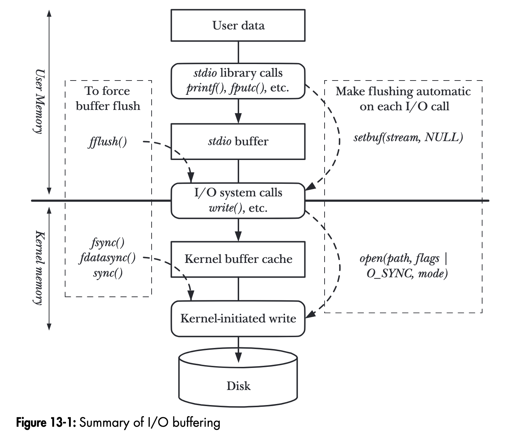
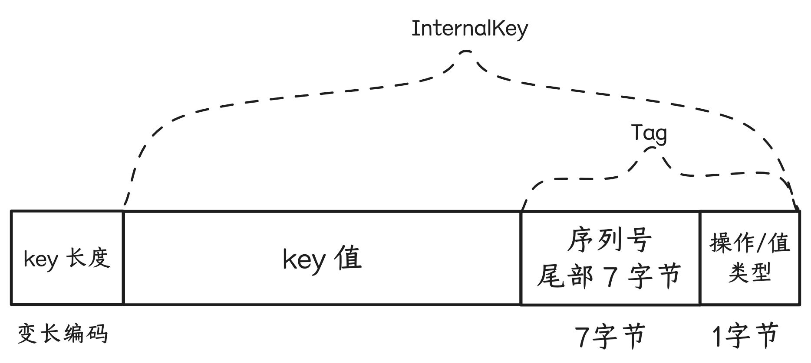
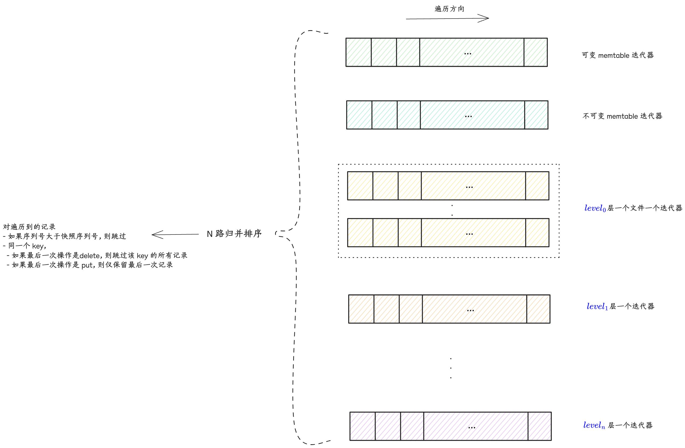
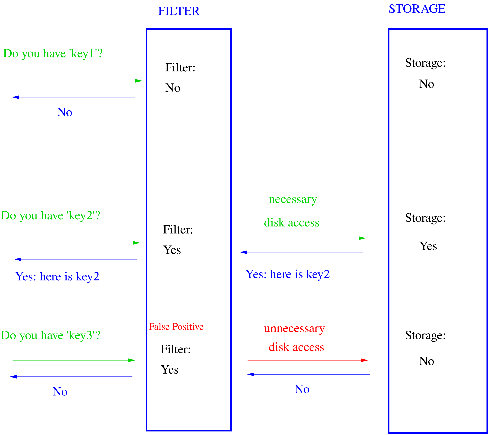

## 9、增删改查


### 9.1 增删改

对于 leveldb（lsm-tree 存储结构）来说，增改操作统一为 put 操作（改也是插入一条新记录），put 操作和删除操作又统一为 write 操作（删除是值为空的写入操作）。write 操作过程为
- 1、先将操作记录（包括原始键值）写到 WAL log 文件
- 2、将操作记录到内存中可变 Memtable 的跳表结构中

写入过程非常简单，所以 leveldb 的写入吞吐可以非常高。不过有3个性能调优点可以注意一下：

- 1、写入操作可以指定是同步的（sync）或者异步的，这里说的<u>同步异步是针对 WAL log 文件写入而言的</u>，需要在吞吐性能和数据一致性之间做好平衡：
    - 如果写入操作指定为同步，那么将操作记录到 WAL log 文件后，还要<u>确保文件内容持久化到磁盘</u>，这个持久化操作对 leveldb 的写入吞吐影响会比较大。
    - 如果写入操作指定为<u>非同步，那么对 WAL log 的文件写入，实际只是写到内核的文件缓冲区</u>。如果写入操作记录到可变 Memtable 并返回写入成功状态给调用方后，内核缓冲区内容刷出到磁盘之前，系统 crash 或者机器掉电都会导致写入数据丢失，存在先写后读的一致性问题。

- 2、leveldb 的实现中，可变 Memtable 对象和不可变 Memtable 对象均只有一个，并且 Memtable 对象的内存占用存在上限阈值，一旦可变 Memtable 写满且不可变 Memtable 还存在（还没来得及 minor compaction 成 $level_0$ 数据文件），那么写入就会被阻塞，那么：
    - 可以适当调大 Memtable 内存占用的上限阈值，但也不能调得很大，因为这会导致 compaction 压力会比较大，间接影响读/检索的性能：
        - 如果 $level_0$ 文件很多，来不及 major compaction，而这些文件的 key 区间又存在重合，就可能需要检索多个 $level_0$ 文件。
        - major compaction 涉及较多的文件磁盘 I/O，从而可能影响检索时的文件读取。

- 3、“不可变 Memtable 对象均只有一个” 如果调整 leveldb 实现支持存在多个 不可变 Memtable 对象，可能存在优化空间；compaction 目前是单线程处理的，如果调整成某种多线程实现，可能也存在优化空间，不过实现起来应该要复杂得多，并且磁盘 I/O 也容易成为检索性能退化的因素。


> 图片摘自《The Linux Programming Interface》一书 244 页。
>
> 对于 WAL log 非同步写入，leveldb 会将内容先写到一块用户态内存缓冲区中，如果缓冲区满，则先调用 `write` 系统调用将用户态缓冲区内容写到内核缓冲区（Kernel buffer cache），将内容的剩余部分继续写到用户态内存缓冲区后，就返回；
> 如果是同步写入，则会再将用户态缓冲区内容 `write` 到内核缓冲区后，再调用 `fsync` 系统调用，将内核缓冲区内容刷到磁盘。

### 9.2 查/范围扫描

#### 9.2.1 快照/snapshot

leveldb 中每个 Put/Delete 操作都被分配了一个序列号（SequenceNum），这个序列号是一种“Lamport 时钟” 或者说 “逻辑时间戳”。
leveldb 支持对数据库做一个快照，这个快照操作非常轻量 - 就是最新分配分配序列号（LastSequence）。这个快照的含义：序列号小于等于LastSequence的操作都属于这个快照的，大于 LastSequence 的操作则不属于这个快照，是在这个快照发生之后发生的。

```cpp title:"Snapshot"
const Snapshot* DBImpl::GetSnapshot() {  
  MutexLock l(&mutex_);  
  return snapshots_.New(versions_->LastSequence());  
}

// Abstract handle to particular state of a DB.  
// A Snapshot is an immutable object and can therefore be safely  
// accessed from multiple threads without any external synchronization.  
class LEVELDB_EXPORT Snapshot {  
 protected:  
  virtual ~Snapshot();  
};

// Snapshots are kept in a doubly-linked list in the DB.  
// Each SnapshotImpl corresponds to a particular sequence number.  
class SnapshotImpl : public Snapshot {  
 public:  
  SnapshotImpl(SequenceNumber sequence_number)  
      : sequence_number_(sequence_number) {}  
  
  SequenceNumber sequence_number() const { return sequence_number_; }  
  
 private:   
  // SnapshotImpl is kept in a doubly-linked circular list. The SnapshotList  
  // implementation operates on the next/previous fields directly.  SnapshotImpl* prev_;  
  SnapshotImpl* next_;  
  
  const SequenceNumber sequence_number_;
};
```

`DBImpl` 对象的 `snapshots_` 字段上维护着快照的链表，是避免 compaction 过程清除掉了快照依赖的键值数据。比如，假设一次快照的序列号为 123456，对于 UK 存在序列号 123455 和 序列号 123457 两次操作，对于这次快照而言，序列号 123457 的操作是不可见的，这个快照存在期间的 compaction 过程都需要同时保留 UK 的这两次操作。这个快照释放之后，compaction 就可以把序列号 123455 的操作清除掉。

因此，快照本身虽然很轻量，不过如果长时间不释放，会导致磁盘空间占用膨胀，对检索性能也会有一定的影响。

#### 9.2.2 点查

指定 key 进行点查的逻辑顺序为：
- 1、从可变 Memtable 的跳表中查找，如果找到就返回给调用方（如果找到的是非删除记录，则返回序列号最大的那个记录的值，且返回状态为默认值“找到”，如果找到的是删除记录，则保留返回值为空，返回状态为“未找到”）
- 2、1 中没找到，则继续从不可变 Memtable 的跳表中查找，如果找到就返回给调用方
- 2、2 中没找到，则从 $level_0$ 开始依次逐层在数据文件中查找，
    - 因为 $level_0$ 数据文件的 key 区间可以存在重合，所以在 $level_0$ 层检索可能会涉及多个数据文件
    - $level_1$~$level_n$ 数据文件的 key 区间不会重合，所以根据最新版本维护的对应层数据文件元信息列表找到目标数据文件即可，如果没找到，则到下一层继续检索
    - 找到目标数据文件后，先对索引块二分查找找到目标数据块，如果目标数据表是经过压缩的，则需要先经过解压，然后根据数据块中的重置位点列表信息，依次进行 delta 解码遍历

点查操作，可以指定一个之前获取的快照信息，如果没有指定，则默认使用最新分配的序列号作为快照，实际查找过程会<u>将快照中的序列号和存储记录中的序列号进行比较，序列号大于快照序列号的记录都会被忽略</u>。

查找键（LookupKey）的编码方式：



与 Memtable 中跳表节点中的 Key 的编码的区别仅在于不包含 value 的长度和 value 值。

```cpp title:LookupKey
// A helper class useful for DBImpl::Get()  
class LookupKey {
public:
  // Initialize *this for looking up user_key at a snapshot with  
  // the specified sequence number.  
  LookupKey(const Slice& user_key, SequenceNumber sequence);

  // Return a key suitable for lookup in a MemTable.  
  Slice memtable_key() const { return Slice(start_, end_ - start_); }

  // Return an internal key (suitable for passing to an internal iterator)  
  Slice internal_key() const { return Slice(kstart_, end_ - kstart_); }

  // Return the user key  
  Slice user_key() const { return Slice(kstart_, end_ - kstart_ - 8); }

private:
  // We construct a char array of the form:  
  //    klength  varint32               <-- start_  
  //    userkey  char[klength]          <-- kstart_  
  //    tag      uint64  
  //                                    <-- end_  
  // The array is a suitable MemTable key.  
  // The suffix starting with "userkey" can be used as an InternalKey.  
  const char* start_;  
  const char* kstart_;  
  const char* end_;  
  char space_[200];  // Avoid allocation for short keys
}

LookupKey::LookupKey(const Slice& user_key, SequenceNumber s) {  
  size_t usize = user_key.size();  
  size_t needed = usize + 13;  // A conservative estimate  
  char* dst;  
  if (needed <= sizeof(space_)) {  
    dst = space_;  
  } else {  
    dst = new char[needed];  
  }  
  start_ = dst;  
  dst = EncodeVarint32(dst, usize + 8);  
  kstart_ = dst;  
  std::memcpy(dst, user_key.data(), usize);  
  dst += usize;  
  EncodeFixed64(dst, PackSequenceAndType(s, kValueTypeForSeek));  
  dst += 8;  
  end_ = dst;  
}

static uint64_t PackSequenceAndType(uint64_t seq, ValueType t) {  
  assert(seq <= kMaxSequenceNumber);  
  assert(t <= kValueTypeForSeek);  
  return (seq << 8) | t;  
}
```

#### 9.2.3 全库/范围有序扫描（遍历）

```cpp title:"遍历的接口定义"
class DB {
public:
 // Return a heap-allocated iterator over the contents of the database.  
 // The result of NewIterator() is initially invalid (caller must  
 // call one of the Seek methods on the iterator before using it).  
 //  
 // Caller should delete the iterator when it is no longer needed.  
 // The returned iterator should be deleted before this db is deleted.  
 virtual Iterator* NewIterator(const ReadOptions& options) = 0; // 接口
}

// 实现
Iterator* DBImpl::NewIterator(const ReadOptions& options) {  
  SequenceNumber latest_snapshot;  
  uint32_t seed;  
  Iterator* iter = NewInternalIterator(options, &latest_snapshot, &seed);  
  return NewDBIterator(this, user_comparator(), iter,  
                       (options.snapshot != nullptr  
                            ? static_cast<const SnapshotImpl*>(options.snapshot)  
                                  ->sequence_number()  
                            : latest_snapshot),  
                       seed);  
}

// 迭代器接口定义
class Iterator {
public:
  // An iterator is either positioned at a key/value pair, or  
  // not valid.  This method returns true iff the iterator is valid.  
  virtual bool Valid() const = 0;

  // Position at the first key in the source.  The iterator is Valid()  
  // after this call iff the source is not empty.  
  virtual void SeekToFirst() = 0;

  // Position at the last key in the source.  The iterator is  
  // Valid() after this call iff the source is not empty.  
  virtual void SeekToLast() = 0;

  // Position at the first key in the source that is at or past target.  
  // The iterator is Valid() after this call iff the source contains  
  // an entry that comes at or past target.  
  virtual void Seek(const Slice& target) = 0;

  // Moves to the next entry in the source.  After this call, Valid() is  
  // true iff the iterator was not positioned at the last entry in the source.  
  // REQUIRES: Valid()  
  virtual void Next() = 0;  
  
  // Moves to the previous entry in the source.  After this call, Valid() is  
  // true iff the iterator was not positioned at the first entry in source.  
  // REQUIRES: Valid()  
  virtual void Prev() = 0;  
  
  // Return the key for the current entry.  The underlying storage for  
  // the returned slice is valid only until the next modification of  
  // the iterator.  
  // REQUIRES: Valid()  
  virtual Slice key() const = 0;  
  
  // Return the value for the current entry.  The underlying storage for  
  // the returned slice is valid only until the next modification of  
  // the iterator.  
  // REQUIRES: Valid() 
  virtual Slice value() const = 0;
}
```

有序遍历接口的使用方式为：
- 1、调用 NewIterator 接口获得迭代器对象指针 - `Iterator* iter`，`options` 参数中可以指定快照，如果未指定，则默认以最新分配的序列号为快照。
- 2、调用 迭代器对象指针 的 Seek 相关接口，初始化遍历起始位置状态：
    - SeekToFirst：不指定起始 key，从头部顺序遍历（不断调用 Next）
    - SeekToLast：不指定起始 key，从尾部逆序遍历（不断调用 Prev）
    - Seek：指定起始 key，从起始 key 开始顺序遍历（不断调用 Next）
- 3、调用方根据迭代器的 `Valid()` 方法返回判断是否遍历结束，或者根据最新遍历到的 key 值做判断是否要结束遍历。

有序（顺序）遍历的实现逻辑类似于 compaction 过程的 N 路归并算法，只不过 compaction 涉及的 level 层 和 level+1 层输入数据文件的 N 路归并排序，而有序遍历则涵盖“可变 memtable”/“不可变 memtable”/“$level_0$~$level_n$ 所有层数据文件”数据库完整状态：

- 1、先针对各部分数据创建各自的迭代器：
    - “可变 memtable” 一个迭代器
    - “不可变 memtable” 一个迭代器
    - $level_0$ 层，因为不同文件的 key 区间可能会重合，所以一个文件一个迭代器
    - $level_1$~$level_n$ 层，因为不同文件的 key 区间不会重合，所以一层一个迭代器，同一层的数据文件按照 key 区间从小到大排序后依次遍历即可
- 2、SeekToFirst / Seek 的逻辑，即是让各个迭代器先各自进行 SeekToFirst / Seek，然后对这些迭代器的读到的首个元素进行比较，获得最小的那个记录
- 3、Next 的逻辑，让上次取得最小元素的那个迭代器先 Next 一次，然后对这些迭代器的读到的首个元素进行比较，获得最小的那个记录
- 4、对于 2/3 中取到的最小记录，因为存在快照约束以及同一个 key 可能存在多次写入（Put 或 Delete），所以需要：
    - 跳过序列号大于快照序列号的记录
    - 同一个 key：如果最后一次写入是 Delete 操作，则跳过该 key 的所有记录；如果最后一次写入是 Put 操作，则跳过最后一次之前的所有记录；从而确保同一个 key 只会遍历返回最新有效的记录。



### 9.4 表缓存 & 块缓存

多线程并发对 leveldb 数据库检索（点查/有序遍历）时，有一些数据文件会被频繁访问（多线程之间以及时序上），将这些文件的句柄以及数据索引等元信息缓存起来进行复用，可以提高检索性能，降低资源消耗。
另外，按照 ldb 文件“块”格式，数据块内容写入文件之前可以先进行压缩，可能存在一些热点数据块，如果每次检索都根据索引<u>从文件中读取数据块并解压</u>再做进一步查找，对性能和资源开销影响会比较大，所以也可以在数据块级别做缓存。

#### 9.4.1 TableCache - 表缓存

leveldb 中存在两类表/Table，逻辑含义是一致，不过指代的东西不一样：
- MemTable 中的跳表
- 一个 ldb 数据文件打开后关联的内存对象，方便检索

TableCache 是对“一个 ldb 数据文件打开后关联的内存对象”进行缓存 - 缓存的键为 ldb 数据文件的 id，值为 ldb 数据文件的 Table 对象。实际的缓存实现采用分片/分段 LRU 缓存，提升并发插入/淘汰能力。

leveldb 实例在版本信息中维护了所有 level ldb 数据文件的元信息 - key 区间最大值最小值、数据文件的 id 等。检索时，
- 1、先根据 key 匹配到目标数据文件的元信息
- 2、根据元信息中的数据文件 id，去 TableCache 中查找对应的 Table 对象，如果不存在，则先打开数据文件，读取解析 footer / index / meta / meta index 这些索引信息，准备好 Table 对象，缓存到 TableCache 中
- 3、基于 Table 对象继续进行数据文件内的检索流程

```plantuml-svg
interface Cache {
+ virtual Handle* Insert(const Slice& key, void* value, ...) = 0
+ virtual Handle* Lookup(const Slice& key) = 0
+ virtual void* Value(Handle* handle) = 0
+ virtual void Release(Handle* handle) = 0
+ virtual void Erase(const Slice& key) = 0
}

class ShardedLRUCache {
- LRUCache shard_[kNumShards]
- port::Mutex id_mutex_
- uint64_t last_id_

+ explicit ShardedLRUCache(size_t capacity)
+ Handle* Lookup(const Slice& key) override
+ void Release(Handle* handle) override
+ void Erase(const Slice& key) override
+ void* Value(Handle* handle) override
}

class LRUCache {}

class TableCache {
+ TableCache(const std::string& dbname, const Options& options, int entries)
+ Iterator* NewIterator(const ReadOptions& options, uint64_t file_number, uint64_t file_size, Table** tableptr = nullptr)
+ Status Get(const ReadOptions& options, uint64_t file_number, uint64_t file_size, const Slice& k, ...)
+ void Evict(uint64_t file_number)

- Status FindTable(uint64_t file_number, uint64_t file_size, Cache::Handle**)
- Cache* cache_
}

class Table {
+ {static} Status Open(const Options& options, RandomAccessFile* file, uint64_t file_size, Table** table)
+ Iterator* NewIterator(const ReadOptions&) const

- static Iterator* BlockReader(void*, const ReadOptions&, const Slice&)
- explicit Table(Rep* rep)
- Status InternalGet(const ReadOptions&, const Slice& key, ...)
- void ReadMeta(const Footer& footer)
- void ReadFilter(const Slice& filter_handle_value)
- Rep* const rep_
}

class Table::Rep {
+ RandomAccessFile* file
+ uint64_t cache_id
+ FilterBlockReader* filter
+ const char* filter_data
+ BlockHandle metaindex_handle
+ Block* index_block
}

Cache <|-- ShardedLRUCache: 实现
LRUCache *-- ShardedLRUCache: 关联
ShardedLRUCache *-- TableCache: 关联
Cache *.. TableCache: 关联
Table::Rep *-- Table: 关联
Table *-- TableCache: 关联
```

leveldb 默认参数支持缓存 990 个 Table，ShardedLRUCache 默认分片数为 16，按照公式计算，每个分片支持 缓存 62 个 Table。

```cpp
struct Options {
  // 省略
  // Number of open files that can be used by the DB.  You may need to  
  // increase this if your database has a large working set (budget  
  // one open file per 2MB of working set).  
  int max_open_files = 1000;
  // 省略
}

const int kNumNonTableCacheFiles = 10;

static int TableCacheSize(const Options& sanitized_options) {  
  // Reserve ten files or so for other uses and give the rest to TableCache.  
  return sanitized_options.max_open_files - kNumNonTableCacheFiles;  
}
```

```cpp title:"计算每个分片的缓存容量"
explicit ShardedLRUCache(size_t capacity) : last_id_(0) {  
  const size_t per_shard = (capacity + (kNumShards - 1)) / kNumShards;  
  for (int s = 0; s < kNumShards; s++) {  
    shard_[s].SetCapacity(per_shard);  
  }  
}
```

#### 9.4.2 BlockCache - 块缓存

BlockCache 的缓存实现方案，可以由调用方实现，并在打开 leveldb 数据库时在 Options 参数中指定。如果没有设置，则默认使用和 TableCache 一样的缓存实现 - ShardedLRUCache，可缓存的 key 数量为 `8 << 20`。
并且需要在检索时的 ReadOptions 参数中指定启用块缓存（默认是启用），才会将块缓存中找不到的数据块读取后插入缓存中。

```cpp
// Should the data read for this iteration be cached in memory?  
// Callers may wish to set this field to false for bulk scans.  
bool fill_cache = true;
```

块缓存使用的键为 “缓存 id” 拼接上 数据块在文件中的偏移位置：

```cpp
char cache_key_buffer[16];  
EncodeFixed64(cache_key_buffer, table->rep_->cache_id);  
EncodeFixed64(cache_key_buffer + 8, handle.offset());  
Slice key(cache_key_buffer, sizeof(cache_key_buffer));  
cache_handle = block_cache->Lookup(key);
```

“缓存 id” 和 Table 对象关联，不同 Table 对象的“缓存 id” 不同，所以“缓存 id” 用于在同一个缓存中区分不同数据文件的数据块。ShardedLRUCache 缓存实现以递增整数的方式分配“缓存 id”：

```cpp
uint64_t NewId() override {  
  MutexLock l(&id_mutex_);  
  return ++(last_id_);  
}
```

compaction 过程会对输入数据文件进行遍历，并且使用的也是同一个 TableCache 实例和各个 Table 实例，如果这个过程也启用块缓存，则会导致大量非热点的数据块缓存起来，对正常检索造成干扰。所以 <u>compaction 过程会将 fill_cache 设置为 false，关闭 compaction 输入遍历的块缓存</u>。

```cpp
// Control over blocks (user data is stored in a set of blocks, and  
// a block is the unit of reading from disk).  
  
// If non-null, use the specified cache for blocks.  
// If null, leveldb will automatically create and use an 8MB internal cache.  
Cache* block_cache = nullptr;  
  
// Approximate size of user data packed per block.  Note that the  
// block size specified here corresponds to uncompressed data.  The  
// actual size of the unit read from disk may be smaller if  
// compression is enabled.  This parameter can be changed dynamically.  
size_t block_size = 4 * 1024;
```

#### 9.4.3 ShardedLRUCache

```plantuml-svg
interface Cache {
+ virtual Handle* Insert(const Slice& key, void* value, ...) = 0
+ virtual Handle* Lookup(const Slice& key) = 0
+ virtual void* Value(Handle* handle) = 0
+ virtual void Release(Handle* handle) = 0
+ virtual void Erase(const Slice& key) = 0
}

class ShardedLRUCache {
- LRUCache shard_[kNumShards]
- port::Mutex id_mutex_
- uint64_t last_id_

+ explicit ShardedLRUCache(size_t capacity)
+ Handle* Insert(const Slice& key, void* value, ...)
+ Handle* Lookup(const Slice& key) override
+ void Release(Handle* handle) override
+ void Erase(const Slice& key) override
+ void* Value(Handle* handle) override
}

class LRUCache {
+ void SetCapacity(size_t capacity)
+ Cache::Handle* Insert(const Slice& key, uint32_t hash, void* value, ...)
+ Cache::Handle* Lookup(const Slice& key, uint32_t hash)
+ void Release(Cache::Handle* handle)
+ void Erase(const Slice& key, uint32_t hash)
+ void Prune()

- void LRU_Remove(LRUHandle* e)
- void LRU_Append(LRUHandle* list, LRUHandle* e)
- void Ref(LRUHandle* e)
- void Unref(LRUHandle* e)
- bool FinishErase(LRUHandle* e)

- LRUHandle lru_
- LRUHandle in_use_
- HandleTable table_
}

class LRUHandle {
+ void* value
+ LRUHandle* next_hash
+ LRUHandle* next
+ LRUHandle* prev
+ size_t key_length
+ bool in_cache
+ uint32_t refs
+ uint32_t hash
+ char key_data[1]
+ Slice key()
}

class HandleTable {
+ LRUHandle* Lookup(const Slice& key, uint32_t hash)
+ LRUHandle* Insert(LRUHandle* h)
+ LRUHandle* Remove(const Slice& key, uint32_t hash)

- uint32_t length_
- uint32_t elems_
- LRUHandle** list_
- LRUHandle** FindPointer(const Slice& key, uint32_t hash)
- void Resize()
}

Cache <|-- ShardedLRUCache: 实现
LRUHandle *-- LRUCache: 关联
HandleTable *-- LRUCache: 关联
LRUCache *-- ShardedLRUCache: 关联
```

HandleTable 是一个“链接法（chaining）” 实现的哈希表，默认初始化 4 个 buckets，每个 bucket 初始值为空指针，指针类型为 `LRUHandle*`，即哈希表节点类型。

HandleTable 中：
- `length_`：表示哈希表的当前容量。
- `elems_`：表示当前哈希表中存储的元素/节点个数，如果 `elems_` 超过 `length_`，则按当前容量的2倍扩容。
- `list_`：即 bucket 数组。

LRUHandle 中：
- `next_hash` 字段：指向当前节点所在 bucket 链表的下一个节点
- `next` & `pre` 字段：指向节点在 LRU 链表中的前置节点和后置节点
- `hash` 字段：存储 key 的哈希值，用于加速在 bucket 链表中遍历查找过程
- `refs`：节点自己的引用计数，初始化时会设置为 1，表示被缓存引用；调用方从缓存中获取到这个节点时，计数会加1；调用方不再使用时会调用 `ShardedLRUCache::Release` -> `LRUCache::Release` -> `LRUCache::Unref` 将计数减1，如果引用计数重新变为1，则表示当前这个节点没有任何调用方在使用，仅缓存持有引用。

ShardedLRUCache 是一个多分片的 LRU 缓存实现，默认16个分片，通过分段锁来减少并发冲突，提升性能。LRU 缓存的检索(Lookup)或插入(Insert)，都先计算 key 的哈希值，将哈希值的头部4个比特的值作为分片 id，然后在目标分片 LRU 缓存中检索或插入。

LRUCache 是实际的 LRU 缓存实现，
- `HandleTable table_`： 实际存放缓存项的哈希表。
- `LRUHandle in_use_`：如果一个缓存项被某个调用方引用（refs > 1），则会被放入 `in_use_` 链表中。这些缓存项不会被 LRU 回收，对于调用方来说是内存安全的。
- `LRUHandle lru_`：如果一个缓存项（LRUHandle）不再被任何调用方引用（refs=1），则将从 `in_use_` 链表中移除，被放入 `lru_` 双向链表中：
    - 这些缓存项还被缓存引用，存在 `table_` 中
    - 最新放入的放在队尾 - 这意味着对头的缓存项是最久未被使用的，当缓存项数量超额时，则从 `lru_` 链表的头部开始逐个缓存项回收
    - 如果其中的缓存项后来被调用方再次检索引用，则会从 `lru_` 中移除，重新放到 `in_use_` 队尾

```cpp
// Dummy head of LRU list.  
// lru.prev is newest entry, lru.next is oldest entry.  
// Entries have refs==1 and in_cache==true.  
LRUHandle lru_ GUARDED_BY(mutex_);  
  
// Dummy head of in-use list.  
// Entries are in use by clients, and have refs >= 2 and in_cache==true.  
LRUHandle in_use_ GUARDED_BY(mutex_);  
  
HandleTable table_ GUARDED_BY(mutex_);
```

LRU 缓存的常规使用方式：
- 1、先从缓存中检索（Lookup），如果未检索到，则：
- 2、准备好缓存的键值，插入缓存（Insert），得到缓存项
- 3、使用完缓存项后，释放引用（Release）

Lookup 过程 - 如果 HandleTable 哈希表中检索到：
- 如果缓存项的引用计数为 1，表示当前缓存项仅被 LRU 缓存引用，挂接在 `lru_` 链表上，所以将当前缓存项从 `lru_` 链表上摘除，挂接到 `in_use_` 链表队尾，并将引用计数加1
- 否则将引用计数加1 即可

Insert 过程 -
- 1、构建缓存项 - 申请内存，设置各个字段的值，引用计数设置为 1（Insert 会把缓存项返回给调用方使用）。
- 2、将缓存项引用计数加1，并挂接到 `in_use_` 的队尾。
- 3、将缓存项插入 HandleTable 哈希表。如果哈希表中已存在相同的 key，则还需要释放缓存自己对原有缓存项的引用。
- 4、如果缓存项数量超额，则从 `lru_` 链表的头部开始逐个回收缓存项（因为这些缓存项仅被缓存自己引用，所以可以安全地进行内存回收），直到缓存项数量未超额。

Release 的过程 -
- 1、将缓存项的引用计数减1。
- 2、将缓存项从 `in_use_` 链表中摘除，挂接到 `lru_` 链表队尾。

### 9.5、过滤策略-布隆过滤器



过滤器匹配返回 false，就一定不在存储中；如果返回 true，有小概率不对（false positive）[^1]。

```plantuml-svg
interface FilterPolicy {
+ virtual const char* Name() const = 0
+ virtual void CreateFilter(const Slice* keys, int n, std::string* dst) const = 0
+ virtual bool KeyMayMatch(const Slice& key, const Slice& filter) const = 0
}

class BloomFilterPolicy {
+ explicit BloomFilterPolicy(int bits_per_key) : bits_per_key_(bits_per_key)
+ const char* Name() const override
+ void CreateFilter(const Slice* keys, int n, std::string* dst) const override
+ bool KeyMayMatch(const Slice& key, const Slice& bloom_filter) const override

- size_t bits_per_key_
- size_t k_
}
FilterPolicy <|-- BloomFilterPolicy
```

```cpp title:"FilterPolicy"
class FilterPolicy {
public:  
 virtual ~FilterPolicy();  
  
 // Return the name of this policy.  Note that if the filter encoding  
 // changes in an incompatible way, the name returned by this method
 // must be changed.  Otherwise, old incompatible filters may be
 // passed to methods of this type.
 virtual const char* Name() const = 0;  
  
 // keys[0,n-1] contains a list of keys (potentially with duplicates)  
 // that are ordered according to the user supplied comparator.
 // Append a filter that summarizes keys[0,n-1] to *dst.
 //
 // Warning: do not change the initial contents of *dst.  Instead,
 // append the newly constructed filter to *dst.
 virtual void CreateFilter(const Slice* keys, int n,  
                           std::string* dst) const = 0;  
  
 // "filter" contains the data appended by a preceding call to  
 // CreateFilter() on this class.  This method must return true if
 // the key was in the list of keys passed to CreateFilter().
 // This method may return true or false if the key was not on the
 // list, but it should aim to return false with a high probability.
 virtual bool KeyMayMatch(const Slice& key, const Slice& filter) const = 0;
}

// Return a new filter policy that uses a bloom filter with approximately  
// the specified number of bits per key.  A good value for bits_per_key  
// is 10, which yields a filter with ~ 1% false positive rate.  
//  
// Callers must delete the result after any database that is using the  
// result has been closed.  
//  
// Note: if you are using a custom comparator that ignores some parts  
// of the keys being compared, you must not use NewBloomFilterPolicy()  
// and must provide your own FilterPolicy that also ignores the  
// corresponding parts of the keys.  For example, if the comparator  
// ignores trailing spaces, it would be incorrect to use a  
// FilterPolicy (like NewBloomFilterPolicy) that does not ignore  
// trailing spaces in keys.
const FilterPolicy* NewBloomFilterPolicy(int bits_per_key);
```

```cpp title:BloomFilterPolicy
static uint32_t BloomHash(const Slice& key) {  
  return Hash(key.data(), key.size(), 0xbc9f1d34);  
}  
  
class BloomFilterPolicy : public FilterPolicy {  
 public:  
  explicit BloomFilterPolicy(int bits_per_key) : bits_per_key_(bits_per_key) {  
    // We intentionally round down to reduce probing cost a little bit 
    /* llama3：
    在Bloom过滤器中，哈希函数次数 k 是一个重要参数，它决定了过滤器的大小和精度。一般来说，k越大，过滤器越大，但也越准确；反之，k越小，过滤器越小，但也越不准确。
    在这个实现中，乘以 0.69 的目的是为了计算出一个合适的 k 值，使得过滤器的大小和精度达到一个平衡。具体来说，乘以 0.69 是为了将 bits_per_key 值乘以一个较小的倍数，从而得到一个较小的 k 值。
    好处是：
	1、减少过滤器大小：通过乘以 0.69，可以得到一个较小的 k 值，这意味着过滤器的大小也会相应减小。这对于存储和传输过滤器来说是一个重要的考虑因素。
	2、提高匹配效率：虽然较小的 k 值可能导致过滤器不准确，但在实际应用中，这个影响往往是可以接受的。因为匹配效率会大幅提高，特别是在过滤器大小相对较小时。
	3、平衡精度和大小：乘以 0.69 的方法可以帮助找到一个合适的 k 值，使得过滤器的大小和精度达到一个平衡。这对于实际应用来说非常重要，因为它可以确保过滤器既能准确又能高效。
    */
    k_ = static_cast<size_t>(bits_per_key * 0.69);  // 0.69 =~ ln(2)  
    if (k_ < 1) k_ = 1;  
    if (k_ > 30) k_ = 30;  
  }  
  
  const char* Name() const override { return "leveldb.BuiltinBloomFilter2"; }  
  
  void CreateFilter(const Slice* keys, int n, std::string* dst) const override {  
    // Compute bloom filter size (in both bits and bytes)  
    size_t bits = n * bits_per_key_;  
  
    // For small n, we can see a very high false positive rate.  Fix it  
    // by enforcing a minimum bloom filter length.
    if (bits < 64) bits = 64;  
  
    size_t bytes = (bits + 7) / 8;  
    bits = bytes * 8;  
  
    const size_t init_size = dst->size();  
    dst->resize(init_size + bytes, 0);  
    dst->push_back(static_cast<char>(k_));  // Remember # of probes in filter  
    char* array = &(*dst)[init_size];  
    for (int i = 0; i < n; i++) {  
      // Use double-hashing to generate a sequence of hash values.  
      // See analysis in [Kirsch,Mitzenmacher 2006].
      uint32_t h = BloomHash(keys[i]);  
      const uint32_t delta = (h >> 17) | (h << 15);  // Rotate right 17 bits  
      for (size_t j = 0; j < k_; j++) {  // 算 k_ 次哈希以及设置 k_ 个比特位
        const uint32_t bitpos = h % bits;  
        // 第几个字节？bitpos / 8
        // 目标字节中的第几个比特？ bitpos % 8
        array[bitpos / 8] |= (1 << (bitpos % 8));  
        h += delta;  // 每次哈希值有变化
      }  
    }  
  }  
  
  bool KeyMayMatch(const Slice& key, const Slice& bloom_filter) const override {  
    const size_t len = bloom_filter.size();  
    if (len < 2) return false;  
  
    const char* array = bloom_filter.data();  
    const size_t bits = (len - 1) * 8;  
  
    // Use the encoded k so that we can read filters generated by  
    // bloom filters created using different parameters.
    const size_t k = array[len - 1];  
    if (k > 30) {  
      // Reserved for potentially new encodings for short bloom filters.  
      // Consider it a match.
      return true;  
    }  
  
    uint32_t h = BloomHash(key);  
    const uint32_t delta = (h >> 17) | (h << 15);  // Rotate right 17 bits  
    for (size_t j = 0; j < k; j++) {  
      const uint32_t bitpos = h % bits;  
      if ((array[bitpos / 8] & (1 << (bitpos % 8))) == 0) return false;  // 任一比特位不匹配，就算不匹配。
      h += delta;  
    }  
    return true;  
  }  
  
 private:  
  size_t bits_per_key_;  
  size_t k_;  
};
```

```cpp title:"KeyValidator-一种简化版"
const int32_t KEY_VALIDATOR_BYTE_SIZE = 128 * 1024 * 1024;  // 128M
const uint64_t KEY_VALIDATOR_VALUE_MASK = 0x3fffffff;  // 30bit
const uint64_t KEY_VALIDATOR_BIT_MASK = 0x07;  
const uint8_t KEY_VALIDATOR_ONE = 1;

const uint8_t KEY_VALIDATOR_LOCK_COUNT = 32;
const uint8_t KEY_VALIDATOR_LOCK_MASK = KEY_VALIDATOR_LOCK_COUNT - 1;

class KeyValidator {
public:
    static KeyValidator& Instance() {
        static KeyValidator instance;
        return instance;
    }

    ~KeyValidator() {
        if (bitmap_data_) {
            delete [] bitmap_data_;
            bitmap_data_ = nullptr;
        }
    }

    bool IsInitialized() {
        return (bitmap_data_ != nullptr);
    }

    bool Init() {
        if (!bitmap_data_) {
            bitmap_data_ = new uint8_t[KEY_VALIDATOR_BYTE_SIZE];
        }
        std::memset(bitmap_data_, 0, KEY_VALIDATOR_BYTE_SIZE);
        // need to catch bad_alloc ?
        LOG(WARNING) << "KeyValidator initialized succ.";
        return true;
    }

    bool Update(uint64_t key_id) {
        if (!bitmap_data_) {
            LOG(ERROR) << "bitmap_data not initialized!";
            return false;
        }
        uint64_t byte_index = 0;
        uint8_t bit_mask = 0;
        GetByteIndex(key_id, byte_index, bit_mask);
        // lock to ensure multi-thread write
        auto& lock = spin_locks[byte_index & KEY_VALIDATOR_LOCK_MASK];
        lock.Lock();
        bitmap_data_[byte_index] |= bit_mask;
        lock.UnLock();
        return true;
    }

    bool IsValid(uint64_t key_id) {
        if (!bitmap_data_) {
            LOG(ERROR) << "bitmap_data not initialized!";
            return false;
        }
        uint64_t byte_index = 0;
        uint8_t bit_mask = 0;
        GetByteIndex(key_id, byte_index, bit_mask);
        return (bitmap_data_[byte_index] & bit_mask);
    }


    bool GetValidKeys(const std::vector<int64_t>& key_list,
                std::vector<int64_t>& result) {
        result.clear();
        result.reserve(key_list.size());
        for (auto& key_id : key_list) {
            if (IsValid(key_id)) {
                result.push_back(key_id);
            }
        }
        return true;
    }

private:
    uint8_t* bitmap_data_ = nullptr;
    std::vector<psarlib::synchronization::SpinLock> spin_locks;

    KeyValidator()
    : spin_locks(KEY_VALIDATOR_LOCK_COUNT) {}

    void GetByteIndex(uint64_t key_id, uint64_t& byte_index, uint8_t& bit_mask) {
        auto value = key_id & KEY_VALIDATOR_VALUE_MASK;
        byte_index = value >> 3;                          // divide by 8
        auto bit_index = value & KEY_VALIDATOR_BIT_MASK;  // mod by 8
        bit_mask = (KEY_VALIDATOR_ONE << bit_index);
    }
};
```

[^1]: [Bloom Filter Calculator](https://hur.st/bloomfilter/)