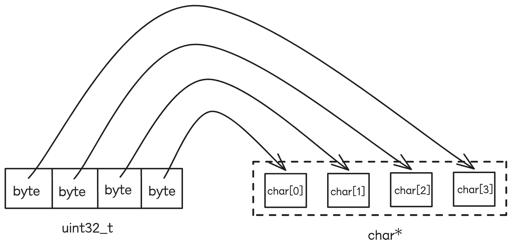
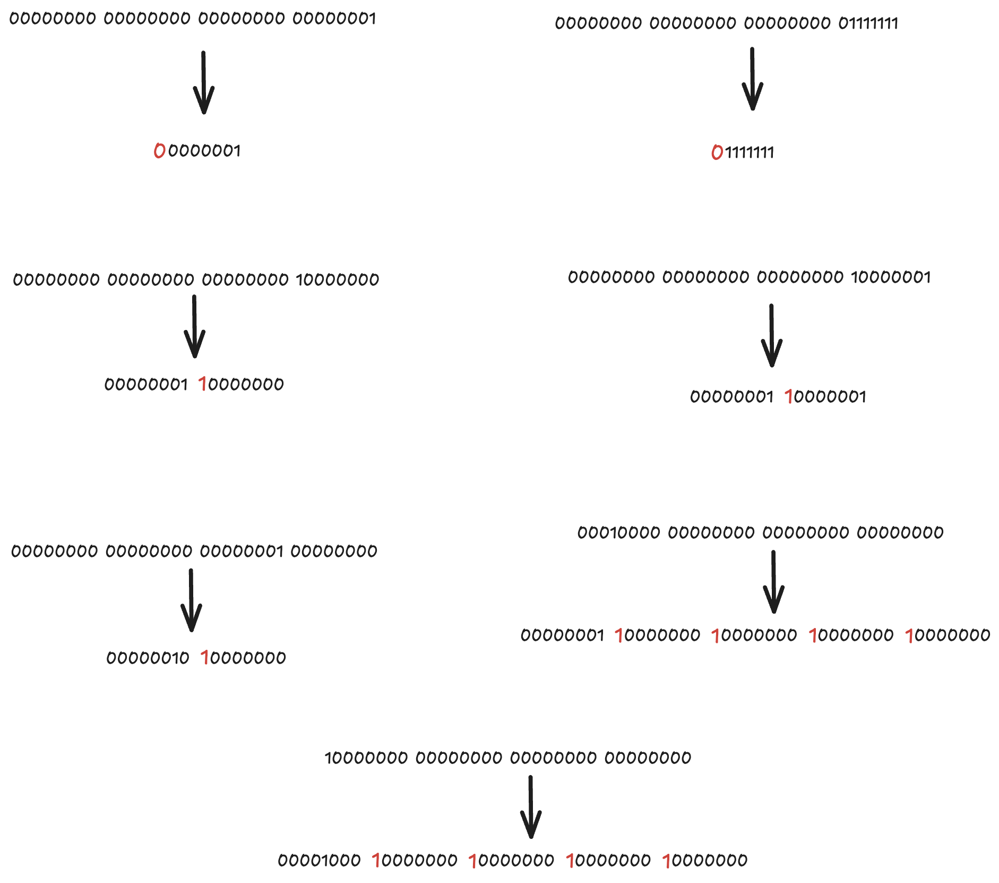

## 10、其他

### 10.1 Env

leveldb 将 文件系统/时间/线程 等和底层系统相关的操作都抽象封装到 Env 类继承体系中，提升可移植性，默认提供对 Posix 兼容系统（Unix/Linux）的支持。

```cpp
Env* Env::Default() {  
  static PosixDefaultEnv env_container;  
  return env_container.env();  
}

// An implementation of Env that forwards all calls to another Env.  
// May be useful to clients who wish to override just part of the  
// functionality of another Env.  
class EnvWrapper : public Env {}
// A wrapper that allows injection of errors.  
class ErrorEnv : public EnvWrapper {}
class InMemoryEnv : public EnvWrapper {}
// Special Env used to delay background operations.  
class SpecialEnv : public EnvWrapper {
// Test Env to override default Env behavior for testing.  
class TestEnv : public EnvWrapper {

class PosixEnv : public Env {}
```

### 10.2 文件锁

leveldb 基于文件锁来防止多个进程打开同一个数据库。

文件锁使用的文件名称为 `LOCK`，对这个文件加锁成功之后，才能执行后续的逻辑。

```cpp
assert(db_lock_ == nullptr);
Status s = env_->LockFile(LockFileName(dbname_), &db_lock_);  
if (!s.ok()) {  
  return s;  
}
```

```cpp
// Lock the specified file.  Used to prevent concurrent access to  
// the same db by multiple processes.  On failure, stores nullptr in  
// *lock and returns non-OK.  
//  
// On success, stores a pointer to the object that represents the  
// acquired lock in *lock and returns OK.  The caller should call  
// UnlockFile(*lock) to release the lock.  If the process exits,  
// the lock will be automatically released.  
//  
// If somebody else already holds the lock, finishes immediately  
// with a failure.  I.e., this call does not wait for existing locks  
// to go away.  
//  
// May create the named file if it does not already exist.  
virtual Status LockFile(const std::string& fname, FileLock** lock) = 0;
```

原理参见：
- https://man7.org/linux/man-pages/man2/fcntl.2.html 的 “Advisory record locking” 部分
- [高级 I/O 之记录锁](https://www.cnblogs.com/nufangrensheng/p/3554168.html)

```cpp title:LockOrUnlock
int LockOrUnlock(int fd, bool lock) {  
  errno = 0;  
  struct ::flock file_lock_info;  
  std::memset(&file_lock_info, 0, sizeof(file_lock_info));  
  file_lock_info.l_type = (lock ? F_WRLCK : F_UNLCK);  
  file_lock_info.l_whence = SEEK_SET;  
  file_lock_info.l_start = 0;  
  file_lock_info.l_len = 0;  // Lock/unlock entire file.  
  return ::fcntl(fd, F_SETLK, &file_lock_info);  
}
```

> cat client 基于 flock 函数来实现文件锁（Open file description locks (non-POSIX)）。与 leveldb 采用的文件锁方式，区别见 fcntl 文档说明：
> Open file description locks are advisory byte-range locks whose operation is in most respects identical to the traditional record locks described above.  This lock type is Linux-specific, and available since Linux 3.15.
> The principal difference between the two lock types is that whereas traditional record locks are associated with a process, open file description locks are associated with the open file description on which they are acquired, much like locks acquired with [flock(2)](https://man7.org/linux/man-pages/man2/flock.2.html).  Consequently (and unlike traditional advisory record locks), open file description locks are inherited across [fork(2)](https://man7.org/linux/man-pages/man2/fork.2.html) (and [clone(2)](https://man7.org/linux/man-pages/man2/clone.2.html) with **CLONE_FILES**), and are only automatically released on the last close of the open file description, instead of being released on any close of the file.
> ...

```cpp title:"cat-client中文件锁的实现方式"
// cat-client中文件锁的实现方式

try {
  lock_file_name_ = FLAGS_cat_multi_process ? std::to_string(getpid()) + FLAGS_cat_id_lock_file
                                            : FLAGS_cat_id_lock_file;

  file_lock_ = new FileLock(lock_file_name_);
  if (!file_lock_->TryLock()) {
    throw runtime_error(lock_file_name_ + " is locked by another process");
  }
}
//
bool FileLock::TryLock() {
  //mode_t m = umask(0);
  fd_ = open(file_name_.c_str(), O_RDWR | O_CREAT, 0666);
  if (fd_ >= 0 && flock(fd_, LOCK_EX | LOCK_NB) < 0) {
    close(fd_);
    fd_ = -1;
    return false;
  }
  return true;
}

bool FileLock::Unlock() {
  if (fd_ < 0) {
    return true;
  }
  remove(file_name_.c_str());
  close(fd_);
  fd_ = -1;
  return true;
}
```

### 10.3 整数编码

定长编码比较简单，使用小端方式，将 32 比特整数拆成 4个 char 存储，将 64 比特整数拆成 8个char 存储。



不定长编码稍微有点麻烦，每8个比特需要使用1个比特位来标识当前这个字节是否是最后一个字节，也就是 char 序列中，每个char 只有尾部7个比特用来存储部分值，头部1比特是状态位。
这意味着：
- 无符号32比特整数，一旦大于 $2^{28}-1$，就需要5个字节来存储
- 无符号64比特整数，一旦大于 $2^{56}-1$，就需要9个字节来存储
- 从存储空间来看，就不划算了



### 10.4 文件 ID

除了 LOCK / CURRENT / LOG 文件，对于“ldb 数据文件”、“WAL log 文件”、“MANIFEST-版本变更日志文件”都使用整数 id 来命名(固定6个字符宽度)，比如 id 为 123，文件名形式如下：
- ldb 数据文件：`000123.ldb`
- WAL log 文件：`000123.log`
- MANIFEST-版本变更日志文件：`MANIFEST-000123`

id 全局自增，统一分配：

```cpp
// Allocate and return a new file number  
uint64_t NewFileNumber() { return next_file_number_++; }
```

这样的好处在于，除非真的需要读取文件时，其他时候的逻辑对于同一种文件类型的不同文件都使用整数 id 来区分，排序/比较等处理逻辑效率更高。

### 10.5 Slice

>`Slice` is a simple structure that contains a length and a pointer to an external byte array. Returning a `Slice` is a cheaper alternative to returning a `std::string` since we do not need to copy potentially large keys and values. In addition, `leveldb` methods do not return null-terminated C-style strings since `leveldb` keys and values are allowed to contain '\0' bytes.

### 10.6 编程技巧

#### 10.6.1 GUARDED_BY - 线程安全注解

```cpp
#ifndef GUARDED_BY  
#define GUARDED_BY(x) THREAD_ANNOTATION_ATTRIBUTE__(guarded_by(x))  
#endif
```

> https://clang.llvm.org/docs/ThreadSafetyAnalysis.html

#### 10.6.2 引用计数

类似 C++11 之后的共享指针，leveldb 对一些类使用引用计数来管理生命周期和资源释放。当一个对象的引用计数归0时，会删除自己（`delete this`），触发析构函数，完成资源清理操作。

```cpp
// Increase reference count.  
void Ref() { ++refs_; }  
  
// Drop reference count.  Delete if no more references exist.  
void Unref() {  
  --refs_;  
  assert(refs_ >= 0);  
  if (refs_ <= 0) {  
    delete this;  
  }  
}
```

## 参考&推荐

- [leveldb 说明文档](https://github.com/google/leveldb/blob/main/doc/index.md)
- [leveldb 逻辑实现说明](https://github.com/google/leveldb/blob/main/doc/impl.md)
- [leveldb ldb 数据文件编码格式](https://github.com/google/leveldb/blob/main/doc/table_format.md)
- [leveldb WAL log 编码格式](https://github.com/google/leveldb/blob/main/doc/log_format.md)
- [Open Data Structures - Skiplists](https://opendatastructures.org/newhtml/ods/latex-saved-html/skiplists.html)
- [Wikipedia - Bloom filter](https://en.wikipedia.org/wiki/Bloom_filter)
- [fcntl(2) — Linux manual page](https://man7.org/linux/man-pages/man2/fcntl.2.html)
- 《The Linux Programming Interface》