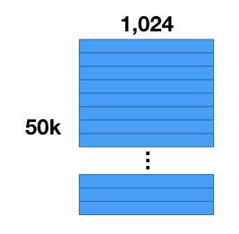
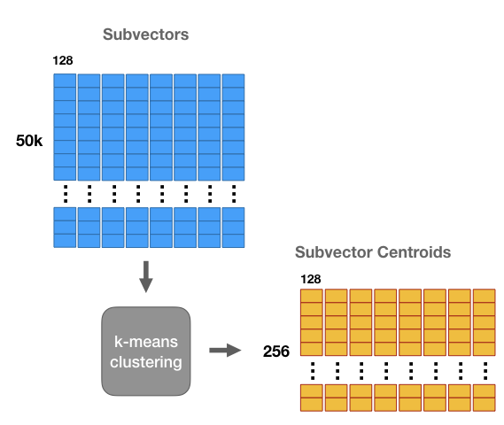
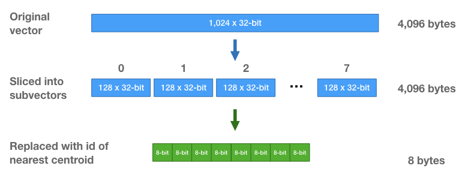

乘积量化器是一种“向量量化器”（后面我会解释这是啥意思），可以用于加速近似最近邻检索。
2017年3月发布的 [Facebook AI 相似性检索（FAISS）库](https://code.facebook.com/posts/1373769912645926/faiss-a-library-for-efficient-similarity-search/)，风靡一时，乘积量化器是其核心组件，吸引了很多人关注。
本教程的第一部分将解释乘积量化器的最基础形式，ANN 检索中通常是这样实现。第二部分将解释 FAISS 中的 “IndexIVFPQ” 索引，这种索引在基础形式的乘积量化器上添加了不少特性。

## 近似距离穷举搜索

不同于 ANN 使用的基于树的索引，单独使用乘积量化器的 k-NN 检索仍然是一种“穷举搜索”，这意味着乘积量化器仍然需要将查询向量（query vector）和数据库中所有向量做比较。乘积量化器的核心是近似地且显著地简化向量的距离计算。

>注意：FAISS 中的 IndexIVFPQ 索引在使用乘积量化器之前会预先过滤数据集 - 第二部分会解释。

## 以示例解释

乘积量化器方法的作者们是信号处理和压缩技术背景的，所以如果你是机器学习方向的，可能对他们的用词和术语比较陌生。不过，如果你熟悉 k-means 聚类（且摒弃所有压缩命名法的词汇），使用一个示例你就能轻松理解乘积量化器的基础知识。之后，我们再回头来看压缩技术相关术语。

## 数据集压缩

假设你有一个 50,000 张的图片集，使用一个卷积神经网络（CNN）完成一些特征的抽取。这样你现在就得到一个 50,000个特征向量的数据集，每个特征向量有 1024 维。

我们要做的第一件事情就是压缩数据集。向量的数量保持不变，但是可以减少每个向量需要的存储空间。注意：我们要做的事情不同于“降维（dimensionality reduction）”！这是因为压缩后的向量中的值其实是符号而不是数值，所以不能直接比较压缩后的向量。

压缩数据集有两大好处：（1）内存访问耗时通常是处理速度的限制因素，（2）对大数据集而言内存容量是个问题。

压缩的原理如下所述：对于我们的示例数据集，将所有向量一起切成8个子向量，每个子向量的长度为 128（8个子向量 $\times$ 每个子向量128维 = 原始向量的 1024 维）。这样就将数据集分成8个矩阵，每个矩阵大小为 $[50K \times 128]$。

然后对这8个矩阵的每一个单独进行 k-means 聚类，k = 256。这样，对于向量的8个子段的每1个都存在256个质心 - 一共8组质心，每组包含256个质心。

这些质心类似于“原型”。它们代表数据集子向量中最常见的模式。

可以使用这些质心来压缩向量数据集 - 使用最接近/最相似的置信来替代向量中对应的每个子部分，从而得到一个不同于原始向量的一个新向量，不过它们之间应该还是相近的。

这样我们就能更加高效地存储这些向量 - 不用存储原始的浮点数值，只要存储聚类中心 ID 即可 - 对每个子向量，找到最近的质心，存储该质心的 ID。每个向量也就被替换为8个质心 ID 的一个序列。

注意：对于8个子部分矩阵的每一个学习到的质心集合是不同的。使用最近质心 id 替换子向量时，只能与对应子部分的 256 个质心做比较。

每个子部分只有 256 个质心，所以仅需 8 比特就能存储一个质心 ID。每个向量，原本包含 1024 个 32 浮点数（4,096 字节），现在仅是 8 个 8 比特整数的序列（每个向量只要8字节的存储空间！）。

## 最近邻搜索

很棒！向量经过压缩了。不过无法对经过压缩的向量直接计算 L2 距离 - 质心 ID 之间的距离是任意且没有实际意义的！（这就是压缩与降维的不同之处）

接下来说说怎么进行最近邻搜索，虽仍是穷举搜索（与所有向量计算距离并排序），不过可以更高效地计算距离 - 只需进行表查找以及某种加法即可。

假设我们有一个查询向量，期望找到它的最近邻居。

一种不太聪明的方式是先解压缩数据集向量，然后计算 L2 距离。也就是，通过串接不同维度的质心重建出向量。下面我们也会这样干，不过比实际地解压缩所有向量在计算上要高效得多。

首先，对查询向量的每个子向量，与该子段的 256 个质心中每一个计算 L2 距离的平方。

这意味着要构建一个子向量距离表，这个表有 256 行（一个质心对应一行） 8 列（一个子段对应一列）。构建这个表成本有多大？相当于计算查询向量与 256 个数据集向量的 L2 距离所需要的数学运算次数。

一旦有了这个表，就可以开始计算查询向量与 50k 个数据库向量中每一个的近似距离了。

每个数据库向量现在只是 8 个质心  ID 的序列。因此要计算一个数据库向量与查询向量之间的相似距离，只需使用这些质心 ID 从表中查找出对应的部分距离，并将它们加和在一起。

只需要将这些部分值加起来就完成了？是的！记住我们在处理的是 L2 距离的平方，所以无需平方根操作。计算 L2 的平方，就是将每个子部分的差平方（squared differences）相加，这些加法操作的次序也无关紧要。

这种查表方式，与对解压缩向量计算距离的方式，得到的结果是一样的，但是计算成本要小得多。

最后一步，与常规的最近邻搜索一样 - 对距离进行排序后找到最小的距离，对应的这些数据库向量就是最近的邻居。打完收工！

## 压缩技术相关术语

我们理解了 PQ 的逻辑原理，现在回过头来学习相关术语就简单了。

广义上而言，量化器就是能够减少变量取值空间（the number of possible values that a variable has）的一种东西。构建一个查找表来减少一张图片的颜色数量（the number of colors），应该是一个不错的例子 - 找到图片中最常见的 256 个颜色数值，放到一张表中，将 24 比特 RGB 色值映射到一个 8 比特整数。

我们获取所有数据库向量的开始 128 个值（8个子段中第1个），对这些 128 个值（数量 $50k \times 128$）进行聚类训练，得到 256 个质心，这 256 个质心就构成了我们所说的“码本（codebook）”。每个质心（一个包含128个浮点数的向量）被称为一个“代码（code）”。

这些质心是用来表征数据库向量的，因此这些代码也可称之为“再生产值（reproduction values）” 或“重建值（reconstruction values）”。将质心 ID 对应的代码串接成序列就能创建一个数据库向量。

8 个子段是分别进行 k-means 聚类的，所以实际创建了 8 个独立的码本。

基于这 8 个码本，组合代码能够创建 $256^8$ 种可能的向量！因此，实际上我们创建一个非常巨大的码本，包含 $256^8$ 个代码。直接习得并存储如此大的单个码本是不可能的事情，由此可见乘积量化器的魔力。

## 预过滤

[本教程的第2部分](http://mccormickml.com/2017/10/22/product-quantizer-tutorial-part-2/)中，我们将学习 FAISS 库中的 IndexIVFPQ 索引，这种索引在使用乘积量化器之前将数据集先分割为多个分区，这样对于每个查询仅需要搜索部分分区。FAISS 发布于 2017 年，IndexIVFPQ 索引使用的乘积量化器方法技术首次见于 [2011 年的这篇论文](https://www.irisa.fr/texmex/people/jegou/papers/jegou_searching_with_quantization.pdf)。