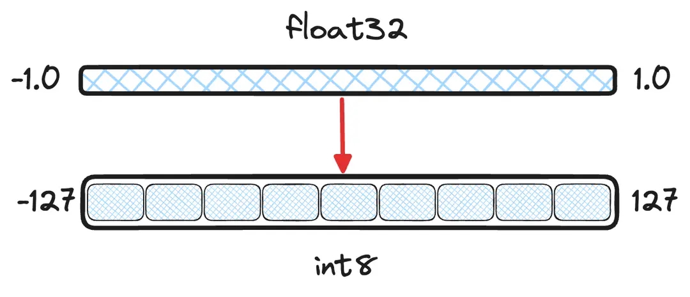
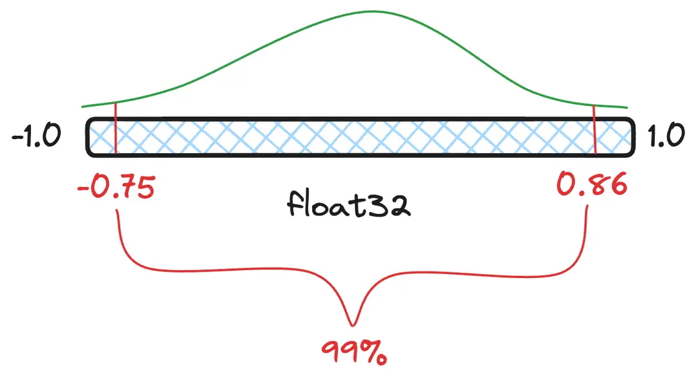

原文：[Scalar quantization 101](https://www.elastic.co/search-labs/blog/scalar-quantization-101)

## 简介

多数嵌入（embedding）模型会输出 $float32$ 数值精度的向量。这个精度虽然提供了信息高保真，但在真正重要的信息之外也带来一些资源浪费。对于给定的数据集，嵌入不可能在单个维度需要20亿种取值，特别是对于高维度向量而言（比如：386维及以上）。量化以一种有损的方式对向量进行编码，轻微降低信息保真而明显地降低存储空间占用。

## 理解标量量化的分桶

标量量化使用更小的数据类型对向量每一维的取值进行分桶。本文的余下部分将假设将 $float32$ 量化到 $int8$ 。为了准确地对值进行分桶，不能简单地将值四舍五入到最近的整数。许多模型输出向量的维度取值空间为 $[-1.0, 1.0]$，如果简单粗暴地四舍五入处理，那么 0.123 和 0.321 这两个不同的向量维度取值都会向下取整到 0。最终，一个向量仅会使用 $int8$ 可用 255 个桶中的2个桶，这样就丢失太多信息了。

>图1：量化目标图解 - 将 -1.0 到 1.0 之间的连续值分桶到离散的 $int8$ 数值。

这种数值转换背后的数学原理并不太复杂。我们可以先计算浮点数取值区间的最小和最大值，然后使用 [最小-最大归一化](https://en.wikipedia.org/wiki/Feature_scaling#Rescaling_(min-max_normalization)) 对值进行线性变换（linearly shift）。

$$int8\approx \frac{127}{max-min} \  \times \left( float32-min \right)$$
$$float32\approx \frac{max-min}{127} \times int8+min$$

>图2：$int8$ 和 $float32$ 之间的变换公式。注意：这两个变换是有损的，并不是精确变换。下面的例子中，仅使用 $int8$ 取值空间的正数部分。Lucene 的实现也是这样的。

## 标量量化的统计视角

[分位点（quantile）](https://en.wikipedia.org/wiki/Quantile) 是指数值分布的一个切片，这个切片包含一定数量比例的值。例如：一种浮点数取值分布下 99% 的值落在 $[-0.75, 0.86]$ 这个分位点区间内，小于 $-0.75$ 和大于 $0.86$ 的值都被视为离群值/异常值（outliers），因此将 $-0.75$ 和 $0.86$ 分别视为实际的最小值和最大值。如果量化时将离群值包含在内，就意味着那些最常见的值可用的桶偏少了，可用桶少了也就意味着精度更差，信息损失更多。

>图3:图解 99%  [置信区间(confidence interval)](https://en.wikipedia.org/wiki/Confidence_interval)及对应的分位点数值，即 99% 的值落在 $[-0.75, 0.86]$ 这个范围内。

不错，我们现在知道如何对浮点值进行量化了，那么又应该如何计算两个量化后向量的距离呢？就像常规的[点积](https://en.wikipedia.org/wiki/Dot_product)计算一样简单吗？

## 标量量化的代数视角

目前为止仍然缺失关键的一块拼图 - 如何计算两个量化后向量之间的距离。本文并没有有意避开数学公式，下面也会出现更多数学内容。拿出你的铅笔，回忆一下[多项式](https://en.wikipedia.org/wiki/Polynomial) 和基础代数。

[点积](https://en.wikipedia.org/wiki/Dot_product)和[余弦相似度](https://en.wikipedia.org/wiki/Cosine_similarity)的计算逻辑是将两个向量对应维度上的浮点值相乘，然后将所有维度上的结果相加。我们已经知道如何在 $float32$ 和 $int8$ 值之间做变换，那么应用变换后的乘法公式是什么样的呢？

$$float32_{i}\times float32_{i}^{\prime}\approx \left( \frac{max-min}{127} \times int8_{i}+min \right) \times \left( \frac{max-min}{127} \times int8_{i}^{\prime}+min \right)$$

将这个乘法公式展开后（为了简化，以 $\alpha$ 替代 $\frac{max-min}{127}$），如下所示：

$$\alpha^{2} \times int8_{i}\times int8_{i}^{\prime}+\alpha \times int8_{i}\times min+\alpha \times int8_{i}^{\prime}\times min+min^{2}$$

接下来就更有意思了 - 这个算式中仅有一个部分要求同时提供两个变量值。然而，点积并不只是两个浮点数相乘，而是两个向量的每一维对应的浮点值相乘。假设向量的维度为 $dim$，那么以下部分算式都可以提前计算好存下来。

$dim\times \alpha^{2}$ 即 $dim\times \left( \frac{max-min}{127} \right)^{2}$ ，可以提前计算好存为单个浮点数。

$\sum_{i=0}^{dim-1} min\times \alpha \times int8_{i}$ 和 $\sum_{i=0}^{dim-1} min\times \alpha \times int8_{i}^{\prime}$ 都可以分别提前计算好存为单个浮点数，或者在检索时计算一次。

$dim\times min^{2}$ 也可以提前计算好存为单个浮点数。

那么：

$$dim\times \alpha^{2} \times dotProduct\left( int8,int8^{\prime} \right) +\sum_{i=0}^{dim-1} min\times \alpha \times int8_{i}+\sum_{i=0}^{dim-1} min\times \alpha \times int8_{i}^{\prime}+dim\times min^{2}$$

点积的整个算式中仅 $dotProduct\left( int8,int8^{\prime} \right)$ 部分需要在检索时计算，加上其他提前计算好的部分就能得到结果。

## 量化的精度保证

那么，这样量化计算的准确性如何？量化后损失信息没有？是的，损失了一些信息，不过量化正是基于我们事实上并不需要所有信息的假设。对于训练得到的嵌入模型，向量各个维度的值分布通常不存在[厚尾性(fat-tails)](https://en.wikipedia.org/wiki/Fat-tailed_distribution)。这意味着值分布存在一定的局部性和一致性。此外，量化对每一维度引入的误差是相互独立的，这意味着对于向量的典型运算（比如点积），误差一定程序上会抵消。

## 总结

哟，一写就写了一堆内容。现在你应该很好地理解了量化的技术优势，其背后的数学原理，以及如何将线性变换考虑在内计算向量之间的距离。