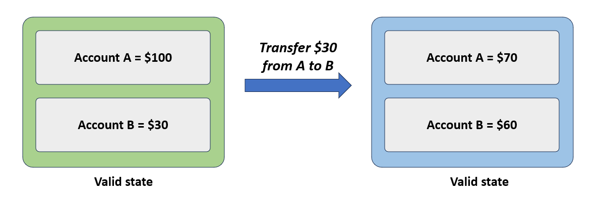
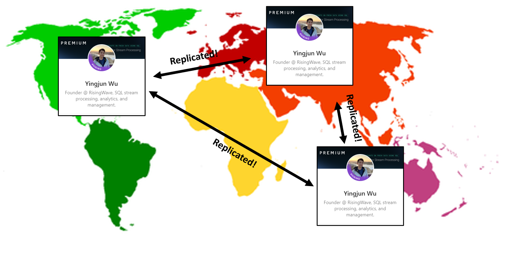
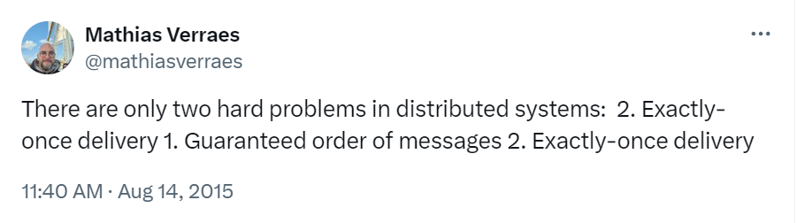
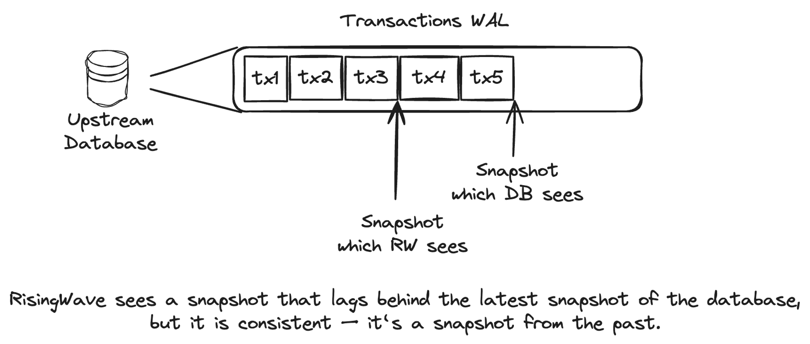

原文： [What Consistency Really Means in Data Systems?](https://risingwave.com/blog/what-consistency-really-means-in-data-systems/)

> 致谢：本译文基于 [沉浸式翻译 chrome 插件](https://chromewebstore.google.com/detail/immersive-translate-trans/bpoadfkcbjbfhfodiogcnhhhpibjhbnh) 的翻译结果，人工调整润色而成。

从事流处理系统开发工作的过去几年里，别人经常对我提出这样一个问题 - “你的系统可以实现强一致性（consistency）吗？”。我常常想自信地推介我们的产品，但现实是，这个问题回答起来其实挺复杂的。要想把这个问题讲清楚，挑战不在于问题本身，而在于“一致性”对不同的人来说意味着不同的东西，取决于他们的技术背景。

事实上，问这个问题的很多人，技术背景都不同，比如：

- 数据库
- 分布式系统
- 流式系统（streaming system）

这些技术背景的人对一致性都有各自不同的理解。没有理解他们问这个问题的上下文背景，就贸然回答，容易导致误解。本文中，我将解释清楚在这些不同数据系统中一致性究竟是什么意思。

## 数据库中的一致性

在传统数据库中，ACID 性质（原子性/Atomicity、一致性/Consistency、隔离型/Isolation、持久性/Durability） 的核心之一就是一致性。这一性质保证了每个事务都将数据库从一个有效状态转换到弄一个有效状态。例如：在一次银行交易中，一个账户扣款另一个账户收款，一致性确保总余额保持不变。千万不要将一致性和原子性混淆了，原子性是指交易/事务要么全有要么全无（all-or-nothing）的性质。例如：原子性确保一个事务中的所有操作要么全部成功完成，要么全部不执行，数据库中不会留下部分事务的效果。

总之，数据库中的一致性强调的是事务过程中保持数据正确性和有效性（validity）的规则。

## 分布式系统中的一致性

关于分布式系统的讨论经常涉及一个基础概念 - 著名 [CAP 定理](https://zh.wikipedia.org/wiki/CAP%E5%AE%9A%E7%90%86) 中的一致性。该定理最初由加州大学伯克利分校的研究人员提出，已成为分布式系统相关大学课程和专业对话中的基本话题。

在 CAP 定理中，“一致性”特指跨不同节点分布的多个副本之间数据的统一性（uniformity）。在分布式系统中确保这种一致性特别有挑战。该定理强调了三个关键属性的重要权衡：一致性、可用性（availability）和分区容错性（partition tolerance）。根据 CAP 定理，一个分布式系统同时只能实现这三个属性中的两个。

在这个上下文语境下，一致性确保在任何给定时间点不同节点上的数据副本体现的信息相同。这对于维护数据完整性至关重要，尤其在涉及网络故障或延迟的场景中。该定理揭示了在多个节点间保持数据同步的固有困难，突出了在设计和维护可靠的分布式系统时平衡这三种相互竞争需求所面临的持续挑战。

## 流式系统中的一致性

在讨论流式系统时，关于一致性的讨论通常与数据库或分布式系统的一致性不同，这反映了流式系统中独特的需求和挑战。[一致性和完整性：重新思考 Apache Kafka 中的分布式流处理](https://www.confluent.io/blog/rethinking-distributed-stream-processing-in-kafka/)一文中，作者认为“精确一次”语义概念是流式系统中一致性的关键特征。

在流式系统中，保持一致性，并非和数据复制相关，而是强调确保每条事件数据仅被处理一次，不多不少，即使在发生系统故障时也是如此。例如，考虑实时处理一次金融交易的情况。如果系统在处理过程中崩溃，那么在系统恢复后，必须确保该交易不会被重复处理。这种精确处理一次的要求对于保持流式数据的完整性和一致性至关重要 - 确保每笔交易都仅被精确处理一次，无论系统是否发生中断。

## 人们真正想要的是什么？

如下表格突出对比了不同系统对一致性要求的差异：

| 系统类型   | 一致性需求         | 示例                                 |
| ---------- | ------------------ | ------------------------------------ |
| 数据库     | 事务完整性         | 银行交易应始终保持账户平衡           |
| 分布式系统 | 节点间数据一致性   | 社交媒体上的个人资料更新必须处处一致 |
| 流式系统   | 次序和处理语义保障 | 每笔金融交易仅被实时处理一次         |

在实际应用中，用户和企业真正追求的是可靠性和数据完整性，这超越了标准教科书对一致性的定义。他们期望系统不仅稳健可靠，而且能够有效管控现实世界的复杂性。于用户而言，衡量系统是否成功的终极标准是其能够始终正确地提供结果，不会出错。必须认识到：要达到这种程序的一致性，系统不能仅仅“感觉上”是正确的，必须具备理论上的严谨性和功能上的可靠性（being theoretically sound and functionally reliable）。

## 分布式流数据库中的一致性

好的，我们来深入探讨一个更有趣的话题：分布式流数据库中的数据一致性。如果你不了解流数据库是什么，[KsqlDB](https://ksqldb.io/) 和 [PipelineDB](https://github.com/pipelinedb/pipelinedb) 就是此类系统。本质上，流数据库是为流处理量身定制的。感兴趣的读者可以参考我[之前写的文章](https://risingwave9.wpcomstaging.com/blog/streaming-databases-everything-you-wanted-to-know/)了解更多细节。在 RisingWave，我们开发了一个分布式流数据库，旨在降低流处理的成本和复杂性。

分布式流数据库是数据库、分布式系统和流系统的结合。那么，它的一致性是什么样的呢？理想情况下，流数据库可以在所有场景下实现一致性，不过这当然也取决于具体系统的实现。在这里我也无法概述所有分布式流数据库的一致性模型，不过可以仅聚焦于 RisingWave： RisingWave 中的一致性看起来是什么样的？我们从三个维度来探讨这个问题。

### 数据库上下文中的“一致性”

RisingWave 提供这种一致性。RisingWave 有效地确保其内部状态能够无缝地从一种有效状态转换到另一种有效状态。然而，需要注意，RisingWave 支持只读事务，不过并不支持跨不同表的读写事务。因此，如果有人需要一个 OLTP 数据库来管理复杂的事务型工作负载，可能选择 [MySQL](https://www.mysql.com/)、[Postgres](https://www.postgresql.org/)、[CockroachDB](https://www.cockroachlabs.com/) 或 [TiDB](https://www.pingcap.com/) 这些方案更为合适。RisingWave 的这一设计决策主要是考虑到两个因素：

- **专注于流数据**：RisingWave 专为优化流数据处理而设计。引入完整的事务能力会显著增大系统的复杂性。
- **与传统 OLTP 数据库集成**：通常情况下，传统 OLTP 数据库负责处理上游的事务序列化。RisingWave，作为一个下游系统，专注于实时分析。深度集成事务处理会导致显著的性能下降，尤其是在现实操作的苛刻条件下。

此外，RisingWave 被设计用于理解和处理来自上游 OLTP 数据库的事务语义，这对金融等行业（sectors）的客户来说是一个关键特性。

### 分布式系统上下文中的“一致性”

RisingWave 提供这种一致性。RisingWave 可以实现跨多个区域的高可用性。RisingWave 没有通过 Paxos 或 Raft 等复杂的共识协议来确保副本间的一致性，而是借助 S3 进行数据存储。S3 不仅存储数据库表，还存储流处理的内部状态，有效地在多个副本间复制数据以保持一致性。

### 流式系统上下文中的“一致性”

RisingWave 提供这种一致性。RisingWave 能够确保精确一次语义，也能轻巧地管理乱序数据处理。这种能力保证了每个数据事件被精确处理一次，无论数据流是否存在中断或干扰，从而在流数据中保持高度一致性。

### 总结

所谓数据系统的一致性，在数据库、分布式系统和流式系统之间涵义差别很大：

- 数据库关注事务完整性。
- 分布式系统强调复制节点之间如何访存数据（how data is accessed across replicated nodes）。
- 流式系统优先考虑消息处理语义保证，比如精确一次语义。

RisingWave 作为一个健壮、可适应的分布式流数据库，有效地满足这些多样化的需求。我们的设计实现方式不仅遵循理论的一致性标准，在实际应用中也表现出色。对于数据一致性需求变化多样的领域（in the evolving landscape of data consistency），RisingWave 是一个可靠的解决方案。