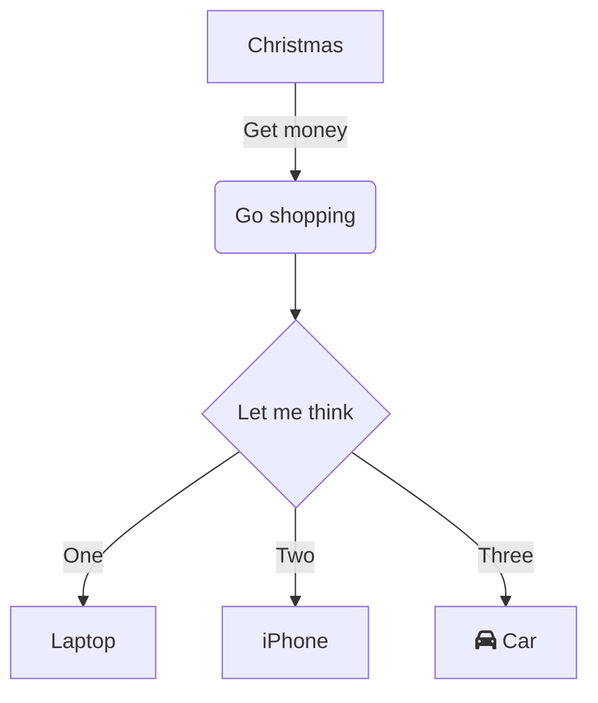

# 示例文章
## 测试标题

>haha
>
- item1
- item2
  - inner item1
  - inner item2
- item3

```python
import sys

if __name__ == '__main__':
  print(sys.argv[1])
```


看看这个数学公式 $LN(v_{i})=\frac{\alpha (v_{i}-\mu )}{\delta} +\beta$ 和代码行 `x = 1`，强调一下这个 **词汇**，以及*斜体*，~~待删除~~，[链接](https://note.pdd.net/doc/852312045147635712)

$$P(w_{1:N})=\prod_{i=1}^{N-1} P(w_{i+1}|w_{1:i})=\prod_{i=1}^{N} o_{i}[w_{i+1}]$$

1. 有序列表项1
2. 有序列表项2
   - 无序列表项1
   - 无序列表项2
3. 有序列表项3

```plantuml-svg
class SQLStatement {
+ StatementType type
+ idx_t stmt_location
+ idx_t stmt_length
+ case_insensitive_map_t<idx_t> named_param_map
+ string query
+ virtual unique_ptr<SQLStatement> Copy() const = 0
}

class SelectStatement {
+ unique_ptr<QueryNode> node
+ unique_ptr<SQLStatement> Copy() const override
+ void Serialize(Serializer &serializer) const
+ static unique_ptr<SelectStatement> Deserialize(Deserializer &deserializer)
}

SQLStatement <|.. SelectStatement

class InsertStatement {
+ unique_ptr<SelectStatement> select_statement
+ vector<string> columns
+ string table
+ string schema
+ string catalog
+ unique_ptr<TableRef> table_ref
+ CommonTableExpressionMap cte_map
+ optional_ptr<ExpressionListRef> GetValuesList() const
}

SQLStatement <|.. InsertStatement

class UpdateSetInfo {
+ unique_ptr<ParsedExpression> condition
+ vector<string> columns
+ vector<unique_ptr<ParsedExpression>> expressions
}

class UpdateStatement {
+ unique_ptr<TableRef> table
+ unique_ptr<TableRef> from_table
+ unique_ptr<UpdateSetInfo> set_info
+ CommonTableExpressionMap cte_map
}

UpdateStatement --> UpdateSetInfo
SQLStatement <|.. UpdateStatement

class QueryNode {
+ QueryNodeType type
+ vector<unique_ptr<ResultModifier>> modifiers
+ CommonTableExpressionMap cte_map
+ virtual const vector<unique_ptr<ParsedExpression>> &GetSelectList() const = 0
}

class SelectNode {
+ vector<unique_ptr<ParsedExpression>> select_list
+ unique_ptr<TableRef> from_table
+ unique_ptr<ParsedExpression> where_clause
+ GroupByNode groups
+ unique_ptr<ParsedExpression> having
+ unique_ptr<ParsedExpression> qualify
+ AggregateHandling aggregate_handling
+ unique_ptr<SampleOptions> sample
+ const vector<unique_ptr<ParsedExpression>> &GetSelectList() const override
}

QueryNode <|.. SelectNode
SelectStatement --> QueryNode

class SetOperationNode {}
class RecursiveCTENode {}
class CTENode {}
class BoundSubqueryNode {}

QueryNode <|.. SetOperationNode
QueryNode <|.. RecursiveCTENode
QueryNode <|.. CTENode
QueryNode <|.. BoundSubqueryNode
```

